## TIM输出比较 OC (Output Compare)

### 简介  

#### 输出比较功能

主要用来输出PWM波形的，常用驱动电机。  
输出比较可以通过比较**CNT**与**CCR**寄存器值的关系，来对输出电平进行置1、置0或翻转的操作，用于输出一定频率和占空比的PWM波形  
每个高级定时器和通用定时器都拥有**4个输出比较通道**（课程主要讨论通用定时器的输出比较功能）  
高级定时器的前3个通道额外拥有死区生成和互补输出的功能  

#### PWM简介

在**具有惯性的系统**中，可以通过对一系列脉冲的宽度进行调制，来等效地获得所需要的模拟参量，常应用于电机控速等领域

**PWM参数**：频率=1/ Ts、占空比= Ton/ Ts、分辨率=占空比变化步距

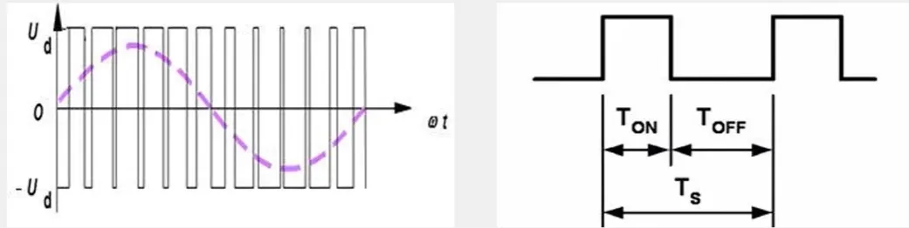

波形也是有高低电平组成的，通过快速切换，产生。

### 输出比较通道（通用）

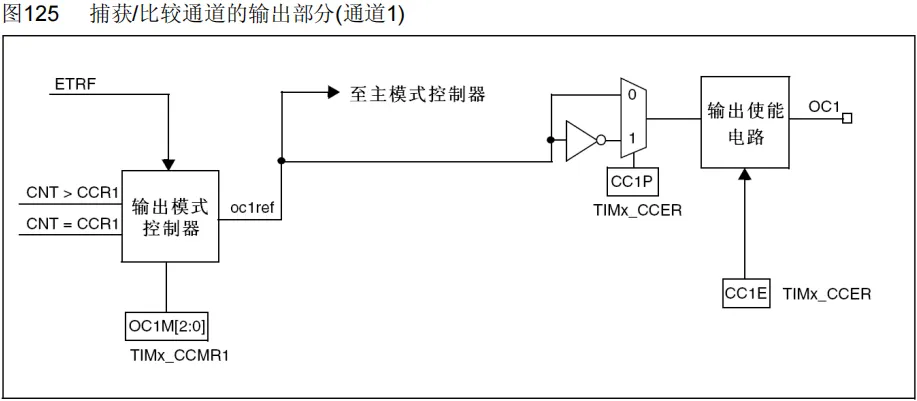

通用定时器通道1和高级定时器的第四个通道基本是一样的。  
**主要流程说明**：ETRF输入是定时器的一个小功能，一般不用，不需要了解

/CNT和CCR1比较产生信号——传入**输出模式控制器**——改变OC1REF的高低电平——映射到主模式的控制器/主要是通往TIMx_CCER(极性选择，高低电平是否翻转)——输出使能，选择通道——通道输出

输出模式控制器：八种模式

|模式|描述|
|---|---|
|冻结|CNT=CCR时，REF保持为原状态|
|匹配时置有效电平|CNT=CCR时，REF置有效电平|
|匹配时置无效电平|CNT=CCR时，REF置无效电平|
|匹配时电平翻转|CNT=CCR时，REF电平翻转|
|强制为无效电平|CNT与CCR无效，REF强制为无效电平|
|强制为有效电平|CNT与CCR无效，REF强制为有效电平|
|PWM模式1|向上计数：CNT<CCR时，REF置有效电平，CNT≥CCR时，REF置无效电平  向下计数：CNT>CCR时，REF置无效电平，CNT≤CCR时，REF置有效电平|
|PWM模式2|向上计数：CNT<CCR时，REF置无效电平，CNT≥CCR时，REF置有效电平  向下计数：CNT>CCR时，REF置有效电平，CNT≤CCR时，REF置无效电平|

冻结模式：设置后输出停止，高低电平不变。  
电平翻转：比如设置CCR=0时候，每次CNT更新清0就会产生一次CNT=CCR的事件，这就会导致输出电平翻转一次，每更新两次，输出为一个周期，占空比始终为50%；改变定时器频率时候，输出波形频率也会随之改变。输出波形的频率=更新频率/2。

强制有效/无效电平：想暂停输出，并保存高电平或者低电平。  
PWM模式1：频率和占空比都可调。

PWM模式2：频率和占空比都可调，二者互为REF电平取反情况。比较灵活。

### 输出比较通道（高级）

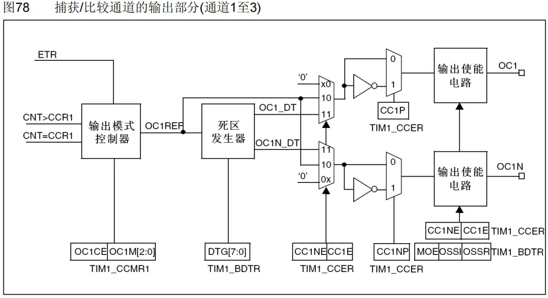

OC1和OC1N是互补输出。死区发生器是防止两个输出同时打开，发热损耗。  

### PWM产生

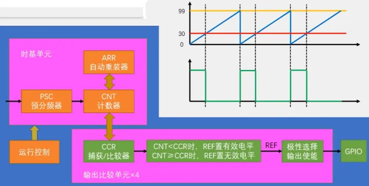

**运行控制+时基单元**：左边的时钟源选择，进入到时基单元后进行相关配置，配置好后CNT计数器就可以不断的自增运行了——往下进入输出比较单元  
**输出比较单元**：一共有4路。最开始是进入CCR捕获/比较寄存器（上图CCR比较的值为30的红色线，可以通过更改值来改变占空比）——输出模式控制（图中假设选择了PWM1模式），输出REF电平——IO输出  
**PWM参数计算**：
PWM频率：Freq= CK_ PSC/(PSC+ 1)/ (ARR+ 1)，PWM的频率=更新周期  
PWM占空比：Duty= CCR/ (ARR+ 1)，CCR的变化范围取决于ARR的值  
PWM分辨率：Reso= 1/(ARR+1)

## TIM输入捕获 IC (Input Capture)

### 简介

- 输入捕获模式下，当通道输入引脚出现**指定电平跳变**时（跳变方向可配置，总的类似外部中断），当前CNT的值将被锁存到CCR中，可用于**测量PWM波形的频率、占空比、脉冲间隔、电平持续时间等**参数  
- 每个高级定时器和通用定时器都拥有4个输入捕获通道  
- 可配置为PWMI模式，同时测量频率和占空比  
- 可配合主从触发模式，实现硬件全自动测量
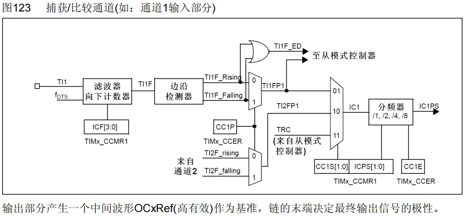

### 频率测量 

#import/pf

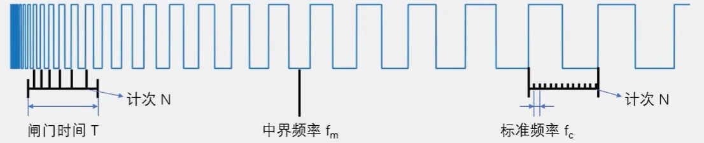

 - 测频法：在闸门时间T内，对上升沿计次，得到N，则频率 $f_{x}=N/T$ 。闸门时间内，N越小误差越大，因此适合高频信号。
- 测周法：两个上升沿内，以标准频率f。定时器计次，得到N，则频率$f_{x}=f_{c}/N$，N计次多可以减小误差，因此适合低频信号。
- 中界频率：测频法与测周法（都有±1误差，N越大误差越小）误差相等的频率点$f_{m}=\sqrt{f_{C}/T}$ 。**待测信号频率<中界频率时，使用测周法；待测信号频率>中界频率时，选用测频法。**

定时器如何实现测周法？上升沿用于触发捕获，两上升沿间，时钟源fc产生的**CNT**值作为N，用于计数计时，使用公式求得fx，清零CNT。

### 主从触发模式

#import/pf

**主模式**：可以将定时器内部的信号，映射到TRGO引脚，用于触发别的外设  
**从模式**：接受其他外设或者自身的信号，即被别的信号控制。其触发源选择就是选择从模式的出发信号源，信号源选择TRGI去触发从模式，从模式可以在列表中选择一项操作来自动执行。（详情查看手册）
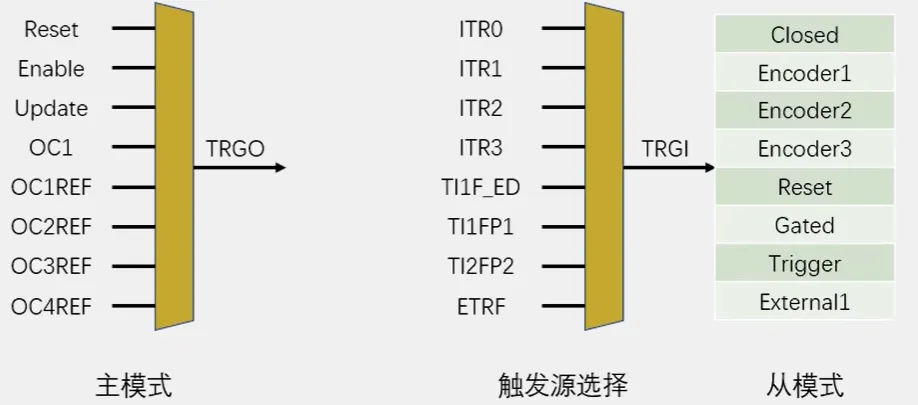

### 输入捕获基本结构

TI1FP1带来触发信号，首先转运CNT的值到CCR1里去，再触发Reset从模式给CNT清零。CCR1的值始终是最新一个周期的计数值N。因此，想要计算频率，只需要读取CCR1的值，再计算fc/N即可。纯硬件自动。

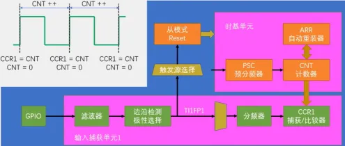

使用一个通道，只能测量频率

注：这里的CNT是有计数上限的，ARR一般设置为最大65535。如果信号频率太低，CNT计完就溢出了。另外从模式清零只有TI1FP1，TI2FP2，通道3、4只能开启捕获中断，在中断里手动清零，会消耗软件资源。

#todo/pf 怎么中断里手动清零

### PWMI基本结构

这个PWMI模式，使用了两个通道同时捕获一个引脚。如图中波形，**上升沿、下降沿都捕获**，CCR1值上升沿开始的是整个周期，而在其中CCR2下降沿触发，只有半个周期（高电平）值。**此时二者一除便是占空比。**

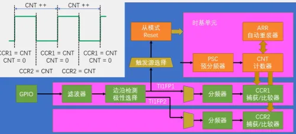

## 编码器 Encoder Interface

- 编码器接口可接收增量 **(正交)编码器** 的信号，根据编码器旋转产生的正交信号脉冲，**自动控制CNT自增或自减（带方向的计次，只需要获取CNT的值即可）**，从而指示编码器的位置、旋转方向和旋转速度  
- 每个高级定时器和通用定时器都拥有1个编码器接口（一般有硬件资源的时候优先使用硬件资源）  
- 两个输入引脚借用了输入捕获的通道1和通道2

### 正交编码器

当旋转编码器转起来时候，会产生两路方波。方波频率代表速度，二者相位比较即可得到方向。通过列表发现二者状态相反，因此首先把A、B相的所有边沿作为计数器的计数时钟，出现边沿信号时候，就计数器自增或者自减，而这个增减由另一项的状态来确定。

|                         |                         |
| ----------------------- | ----------------------- |
|   | 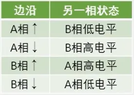 |
|  | 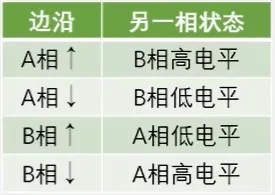 |

### 定时器编码器框图

高级定时器和通用定时器都拥有1个编码器接口，普通定时器没有。

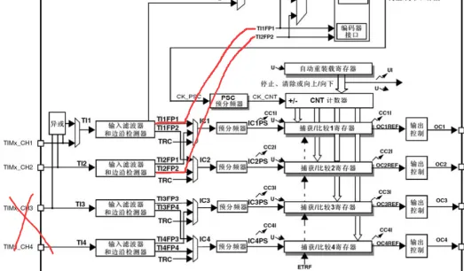

可以看到编码器的**两个输入引脚**借用了输入捕获单元的前**两个通道CH1/CH2**。输入部分滤波和边缘检测编码器都有使用。  
编码器输出部分相当于从模式控制器，去控制CNT的计数时钟和计数方向，即如果出现边沿信号，并且另一相的状态为正转，CNT自增，否则自减。此时触发控制处于编码器接口托管的状态，72M计数时钟和时基单元计数方向并不会被使用。

### 编码器接口基本结构

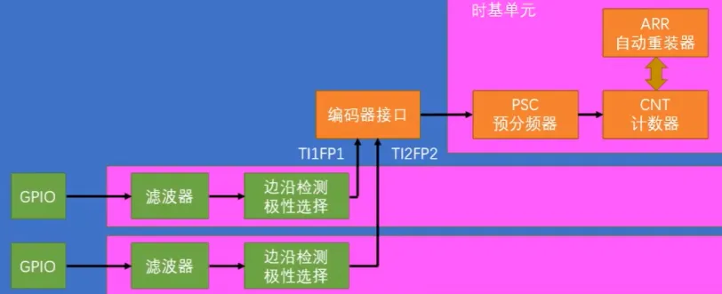

可以通过设置ARR的数值为65535，通过**补码**的特性，很容易得到负数。

### 工作模式

A相——TI1FP1；B相——TI2FP2；

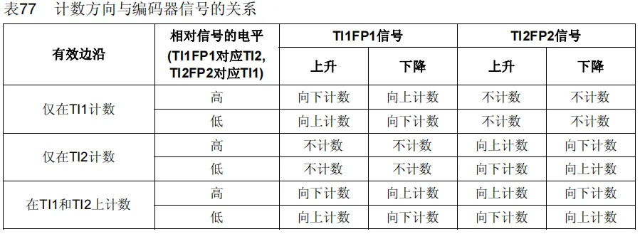
