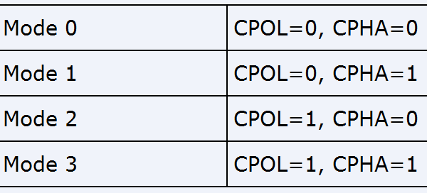

- 3 线、4 线 SPI 模式
	- 四线
		- SDO/MOSI – 主设备数据输出，从设备数据输入，如主机读取命令；
		- SDI/MISO – 主设备数据输入，从设备数据输出，如从机返回数据；
		- SCLK – 时钟信号，由主设备产生，用于数据同步；
		- CS/SS – 从设备使能信号，由主设备控制来选择与哪一个从机进行通讯；
	- 三线
		- SDO/MOSI与SDI/MISO共用一条总线，采用半双工通讯。
- SPI中的极性CPOL和相位CPHA
	- 
	- 
	- CPOL极性
		- SPI的CPOL，表示当SCLK空闲idle的时候，其电平的值是低电平0还是高电平1：
		- CPOL=0，时钟空闲idle时候的电平是低电平，所以当SCLK有效的时候，就是高电平，就是所谓的active-high；
		- CPOL=1，时钟空闲idle时候的电平是高电平，所以当SCLK有效的时候，就是低电平，就是所谓的active-low；
	- CPHA相位
		- 相位，对应着数据采样是在第几个边沿，是第一个边沿还是第二个边沿
		- 0对应着第一个边沿，1对应着第二个边沿
- LSB和MSB
- 双线SPI和四线DPI
	- SPI是全双工的，即同一时刻下可以发送数据，也可以接收数据
	- 但是对于一些SPI设备而言，其并不需要全双工，反而需要更快的速度
	- 为此推出了==Dual SPI(双线 SPI)==，就是 ==MOSI、MISO 同时朝一个方向发送数据==，单次可以同时传输两 bit这样一个时钟周期内就能传输2个bit数据，加倍了数据传输的速度
	- ==Quad SPI(四线 SPI)== ，为四线半双工，增加了两个数据引脚线IO2、IO3，此时IO0、IO1、IO2、IO3 引脚被用于向同一个方向传输数据，单次 可传输 4bit
