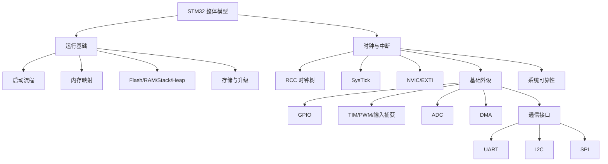

# STM32 知识体系

这套笔记按“先建立整体模型，再理解运行基础，最后学习外设和系统能力”的顺序组织。

它不是某块开发板的操作手册，也不是 HAL 函数速查表，而是帮助自己真正理解 STM32：CPU 怎么运行程序、外设怎么接到总线、时钟和中断为什么到处出现、外设之间如何协作。

## 学习路线

| 顺序  | 主题                                                                                    | 建议目标                      |
| --- | ------------------------------------------------------------------------------------- | ------------------------- |
| 1   | [[00-学习路线/STM32应该怎么学\|STM32 应该怎么学]]                                                   | 先知道学习顺序，不被零散外设拖乱          |
| 2   | [[01-整体模型/STM32整体模型\|STM32 整体模型]]                                                     | 把内核、总线、寄存器、外设、引脚连成一张图     |
| 3   | [[02-运行基础/启动流程\|启动流程]]                                                                | 理解程序从复位到 `main()` 之前发生了什么 |
| 4   | [[03-时钟与中断/时钟系统\|时钟系统]]、[[03-时钟与中断/中断系统\|中断系统]]                                       | 掌握所有外设都离不开的两条主线           |
| 5   | [[04-基础外设/GPIO\|GPIO]]、[[04-基础外设/TIM\|TIM]]、[[04-基础外设/ADC\|ADC]]、[[04-基础外设/DMA\|DMA]] | 理解最常见外设的工作模型              |
| 6   | [[05-通信接口/通信接口总览\|通信接口总览]]                                                            | 建立 UART/I2C/SPI 的对比视角     |
| 7   | [[06-存储与升级/Boot与下载方式\|Boot 与下载方式]]、[[07-系统可靠性/看门狗\|看门狗]]                              | 补齐工程可靠性和升级思维              |

## 主题地图

## 分区导航

### 00 学习路线

| 笔记                                  | 作用                        |
| ----------------------------------- | ------------------------- |
| [[00-学习路线/STM32应该怎么学\|STM32 应该怎么学]] | 建立学习顺序和知识分层               |
| [[00-学习路线/如何看手册\|如何看手册]]            | 区分数据手册、参考手册、编程手册和库文档      |
| [[00-学习路线/常见概念总览\|常见概念总览]]          | 对 MCU、内核、外设、总线、寄存器等概念先做总览 |

### 01 整体模型

| 笔记 | 作用 |
|---|---|
| [[01-整体模型/STM32整体模型\|STM32 整体模型]] | 从系统视角理解 STM32 |
| [[01-整体模型/内核总线外设\|内核总线外设]] | 理解 CPU 如何访问外设 |
| [[01-整体模型/寄存器与外设配置\|寄存器与外设配置]] | 理解配置外设本质上是在写寄存器 |
| [[01-整体模型/引脚复用\|引脚复用]] | 理解 GPIO、外设功能和引脚之间的关系 |

### 02 运行基础

| 笔记 | 作用 |
|---|---|
| [[02-运行基础/启动流程\|启动流程]] | 从上电复位到进入 `main()` |
| [[02-运行基础/内存映射\|内存映射]] | 理解地址空间和外设地址 |
| [[02-运行基础/Flash RAM Stack Heap\|Flash RAM Stack Heap]] | 理解程序和数据放在哪里 |
| [[02-运行基础/MAP文件\|MAP 文件]] | 学会看编译后的空间占用 |

### 03 时钟与中断

| 笔记 | 作用 |
|---|---|
| [[03-时钟与中断/时钟系统\|时钟系统]] | 理解 RCC、SYSCLK、HCLK、PCLK |
| [[03-时钟与中断/SysTick\|SysTick]] | 理解系统节拍定时器 |
| [[03-时钟与中断/中断系统\|中断系统]] | 理解 NVIC 和优先级 |
| [[03-时钟与中断/EXTI\|EXTI]] | 理解外部中断如何从引脚进入 CPU |

### 04 基础外设

| 笔记 | 作用 |
|---|---|
| [[04-基础外设/GPIO\|GPIO]] | 数字输入输出和引脚模式 |
| [[04-基础外设/TIM\|TIM]] | 定时、计数和事件产生 |
| [[04-基础外设/PWM与输入捕获\|PWM 与输入捕获]] | 输出波形和测量外部信号 |
| [[04-基础外设/ADC\|ADC]] | 模拟量采样 |
| [[04-基础外设/DMA\|DMA]] | 无需 CPU 搬运数据 |

### 05 通信接口

| 笔记 | 作用 |
|---|---|
| [[05-通信接口/通信接口总览\|通信接口总览]] | 对比 UART/I2C/SPI/CAN/USB |
| [[05-通信接口/UART\|UART]] | 异步串口通信 |
| [[05-通信接口/I2C\|I2C]] | 双线、多设备、地址式通信 |
| [[05-通信接口/SPI\|SPI]] | 同步高速移位通信 |

### 06 存储与升级

| 笔记 | 作用 |
|---|---|
| [[06-存储与升级/内部Flash\|内部 Flash]] | 理解片内 Flash 的读写限制 |
| [[06-存储与升级/Boot与下载方式\|Boot 与下载方式]] | 理解 ISP、ICP、IAP 和启动模式 |
| [[06-存储与升级/IAP\|IAP]] | 理解应用内升级的基本模型 |

### 07 系统可靠性

| 笔记 | 作用 |
|---|---|
| [[07-系统可靠性/PWR与低功耗\|PWR 与低功耗]] | 理解睡眠、停机、待机 |
| [[07-系统可靠性/RTC\|RTC]] | 理解实时时钟和备份域 |
| [[07-系统可靠性/看门狗\|看门狗]] | 理解 IWDG 和 WWDG |

### 90 概念对照与易错点

| 笔记 | 作用 |
|---|---|
| [[90-概念对照与易错点/概念对照表\|概念对照表]] | 集中比较容易混淆的术语 |
| [[90-概念对照与易错点/易错点索引\|易错点索引]] | 按错误现象反查知识点 |

