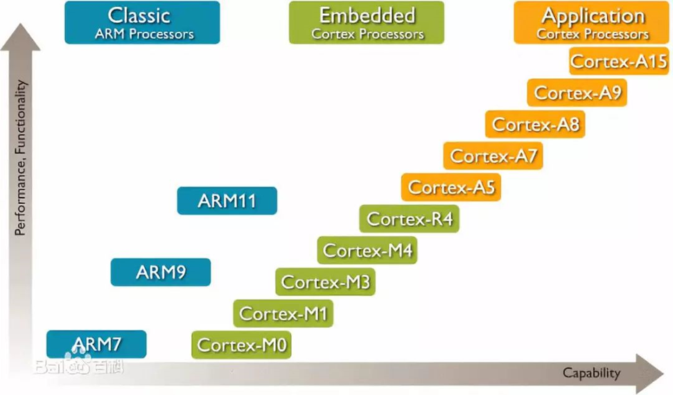
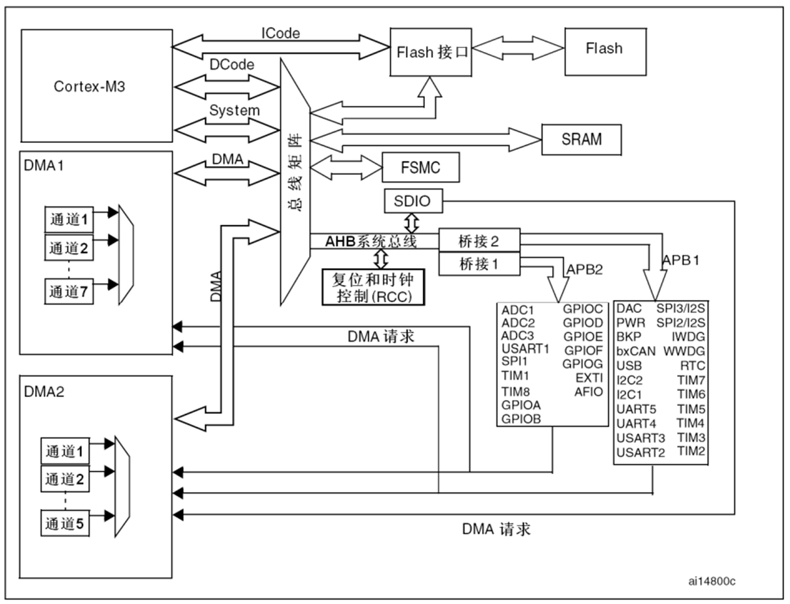
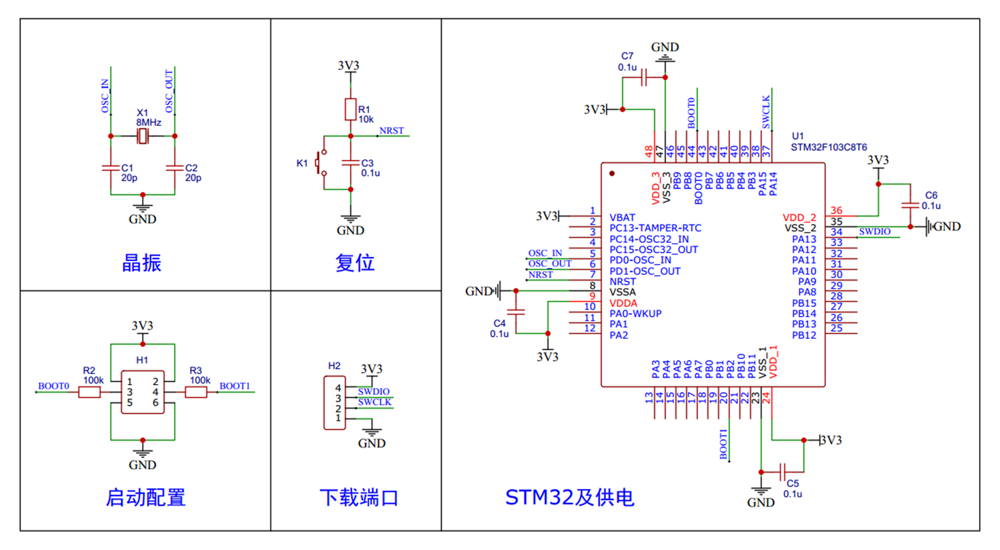

## ARM型号

## STM32F103C8T6

•系列：主流系列STM32F1

•内核：ARM Cortex-M3

**•主频：72MHz**

**•RAM：20K（SRAM）**

**•ROM：64K（Flash）**

**•供电：2.0~3.6V（标准3.3V）**

•封装：LQFP48

## **F1系列**片上资源/外设

| 英文缩写        | 名称            | 英文缩写    | 名称        |
| ----------- | ------------- | ------- | --------- |
| **NVIC**    | **嵌套向量中断控制器** | CAN     | CAN通信     |
| **SysTick** | **系统滴答定时器**   | USB     | USB通信     |
| RCC         | 复位和时钟控制       | RTC     | 实时时钟      |
| GPIO        | 通用IO口         | CRC     | CRC校验     |
| AFIO        | 复用IO口         | PWR     | 电源控制      |
| EXTI        | 外部中断          | BKP     | 备份寄存器     |
| TIM         | 定时器           | IWDG    | 独立看门狗     |
| ADC         | 模数转换器         | WWDG    | 窗口看门狗     |
| DMA         | 直接内存访问        | DAC     | 数模转换器     |
| USART       | 同步/异步串口通信     | SDIO    | SD卡接口     |
| I2C         | I2C通信         | FSMC    | 可变静态存储控制器 |
| SPI         | SPI通信         | USB OTG | USB主机接口   |

- NVIC：内核中管理中断的，比如中断优先级
- SysTick：主要用来给操作系统提供定时服务，当然本课程不使用操作系统，因此可以用来生成Delay函数。
- RCC：对系统的时钟进行配置，还有就是**使能各模块的时钟**。不给时钟的情况下，操作外设是无效的，外设也不会工作，这样的目的是降低功耗。
- [GPIO](GPIO.md)：引脚控制。
- AFIO：复用IO口，可以完成复用功能的重定义，还有中断端口的配置。
- EXTI：是外部中断，配置好外部中断后，当引脚有电平变化时候，就可以出发中断，让CPU来处理任务。
- [TIM](TIM.md)：定时器，整个STM32中最常用、功能最多的外设。分为高级定时器（复杂）、通用定时器（常用）、基本定时器三种类型。生产PWM波最常用。
- [ADC](ADC.md)：模数转换器，STM32内置了12位的AD转换器，可以直接读IO口的模拟电压值，无需外部联结AD芯片，使用非常方便。
- DMA：是直接内存访问，这个可以帮助CPU完成搬运大量数据这样的繁杂任务。
- [USART](串口.md)：同步或者异步串口，我们常用的UART是异步串口的意思。
- [I2C](I2C.md)：非常常用的通信协议。STM32内置了控制器，可以用硬件来输出时序波形。使用起来更高效，当然，用通用IO口来模拟时序波形也是没有问题的。
- [SPI](SPI.md)：非常常用的通信协议。STM32内置了控制器，可以用硬件来输出时序波形。使用起来更高效，当然，用通用IO口来模拟时序波形也是没有问题的。
- CAN：通信协议，一般用于汽车领域。
- USB：通信协议，生活中到处都是，可以通过STM32USB外设制作模拟鼠标，模拟U盘。
- RTC：是实时时钟，在STM32内部完成年月日、时分秒的计时功能，而且可以接外部备用电池，即使掉点也能正常运行。
- CRC：一种数据的校验方式，用于判断数据正确性，有了这个外设的支持，进行校验就会更方便一些。  ****
- PWR：电源控制，可以让芯片进入睡眠模式等状态。来达到省点的目的。
- BKP：备份寄存器，一段存储器，当系统掉电，仍可用备用电池保持数据，这个根据需要可以完成一些特殊功能。
- IWDG：独立看门狗
- WWDG：窗口看门狗，当单片机因为电磁干扰四级或者程序设计不合理出现死循环时候，看门狗可以及时复位芯片，保证系统的稳定性。

**窗口看门狗与独立看门狗区别**
[独立看门狗和窗口看门狗_窗口看门狗和独立看门狗-CSDN博客](https://blog.csdn.net/2301_77164542/article/details/131351687?ops_request_misc=%257B%2522request%255Fid%2522%253A%2522BED36465-A1C6-4615-819B-D9E8E22D00A7%2522%252C%2522scm%2522%253A%252220140713.130102334..%2522%257D&request_id=BED36465-A1C6-4615-819B-D9E8E22D00A7&biz_id=0&utm_medium=distribute.pc_search_result.none-task-blog-2~all~sobaiduend~default-1-131351687-null-null.142^v100^pc_search_result_base4&utm_term=%E7%AA%97%E5%8F%A3%E7%9C%8B%E9%97%A8%E7%8B%97%E4%B8%8E%E7%8B%AC%E7%AB%8B%E7%9C%8B%E9%97%A8%E7%8B%97&spm=1018.2226.3001.4187)
窗口看门狗：系统时钟源，精确。独立看门狗：独立时钟， LSI (40KHz) ，不精确。
窗口看门狗严格限定喂狗时间段，独立看门狗则是只要没有到时间，都能喂狗。

下面这四个C8T6没有，具体需要看手册。

- DAC：数模转换器，可以直接在IO口输出模拟电压。
- SDIO：是SD卡接口，可以用来读取SD卡。
- FSMC：是可变静态存储控制器，可以用于扩展内存，或者配置成其他总线协议，用于某些硬件的操作。
- USB OTG：用OTG功能，可以让STM32作为USB主机去读取其他USB设备。

## 命名规则

## 系统结构

## 引脚定义

有时候拿到一块芯片我们可以先看他的引脚定义，看完就大概知道这个芯片是怎么用的了。

## 启动模式

 #import/pf 

注意**BOOT引脚的值是在上电一瞬间有效**的，之后就随便了。

在默认情况下，BOOT0和BOOT1均置0，而大家也不必管他，我们只有遇到一些特殊情况时，才有考虑使用BOOT引脚的必要

该功能区域一共有三种启动引导方式可供我们选择

见下表：

- BOOT1=x BOOT0=0 从用户闪存启动，这是正常的工作模式。一般常用的也是这个模式
    你的BOOT引脚现在大概率就是这个状态
- BOOT1=0 BOOT0=1 从系统存储器启动，这种模式启动的程序功能由厂家设置。
    其中烧录的程序在出厂时就已确定，不可修改
- BOOT1=1 BOOT0=1 从内置SRAM启动，这种模式可以用于调试。
    但是断电之后，程序无法保存

## 最小系统电路

【STM32供电电路】3.3V和GND之间一般连接了一个滤波电容，会让电源更加稳定，**一般遇到供电都会习惯性的加几个滤波电容**。其中VBAT是接备用电池的，是给RTC和备份寄存器使用的。

【晶振电路】接了一个8MHz的主时钟晶振，**STM32的主晶振一般都是8MHz**的，通过颞部锁相环倍频得到了72MHz的主频。连接到5、6引脚，另外还需要两个20pF的电容，作为起振电容，电容的另一端接地即可。

如果需要RTC的话，还需要再接一个32.768KHz的晶振（OSC32），电路和这个一样，但是接在3、4号引脚。为什么是32.768KHz呢？因为32768是2的15次方，内部的RTC电路经过2^15分频就可以生成1秒的时间信号了。

【**复位电路**】10k的电阻和0.1μF的电容组成的，提供复位信号。产生先低电平然后电容充完电又变高电平，这个低电平信号就成为了复位信号，所以一上电的瞬间就复位了。当然他提供了一个摁键，当摁键摁下的时候电容接地放电了，然后松开就会发生复位的过程，产生复位信号。

【启动配置】拨动开关，在最小系统板上使用的是跳线帽来选择的。

【下载端口】如果是用ST-Link下载程序的话，就需要吧SWDIO和SWCLK两个引脚印出来方便接线，GND是一定要引出来的，3.3V如果板子自己有供电的话就不用引，建议都引。

资料原理图上多了一些**稳压芯片**将5V转化为3.3V，常用的有XC6206、AMS1117。
