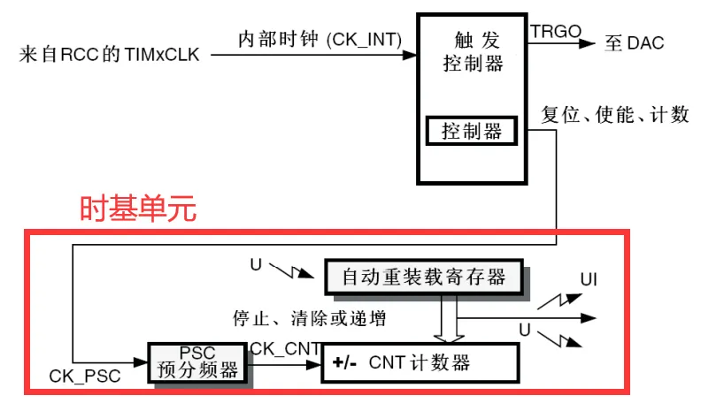
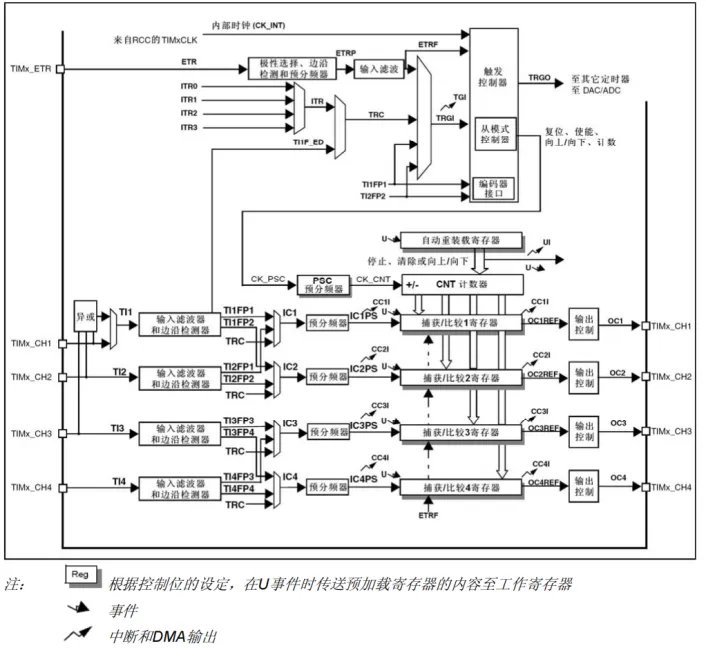
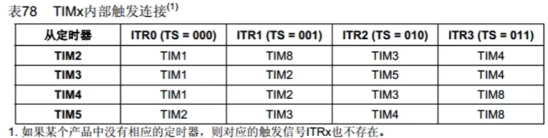
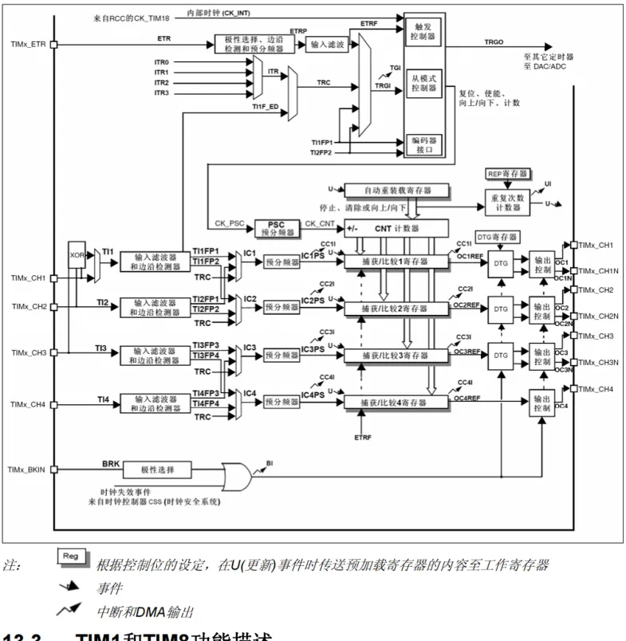
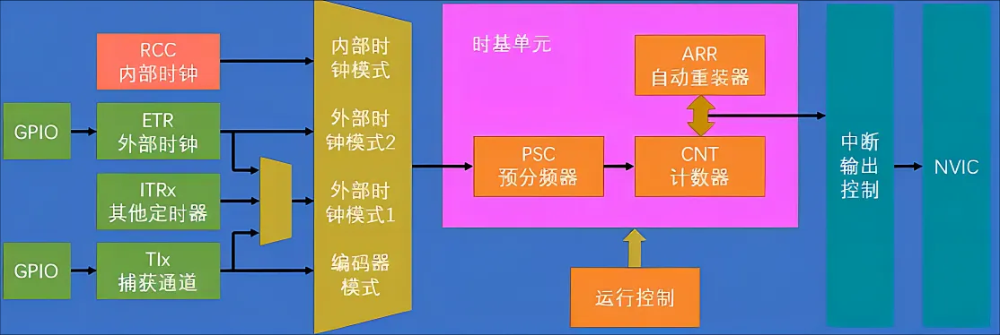
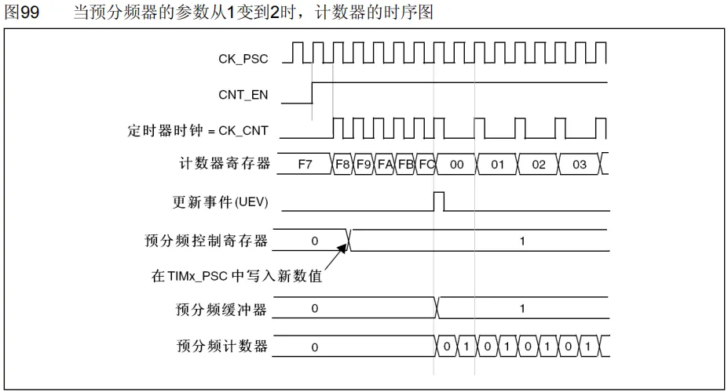
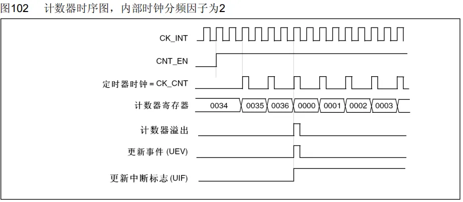
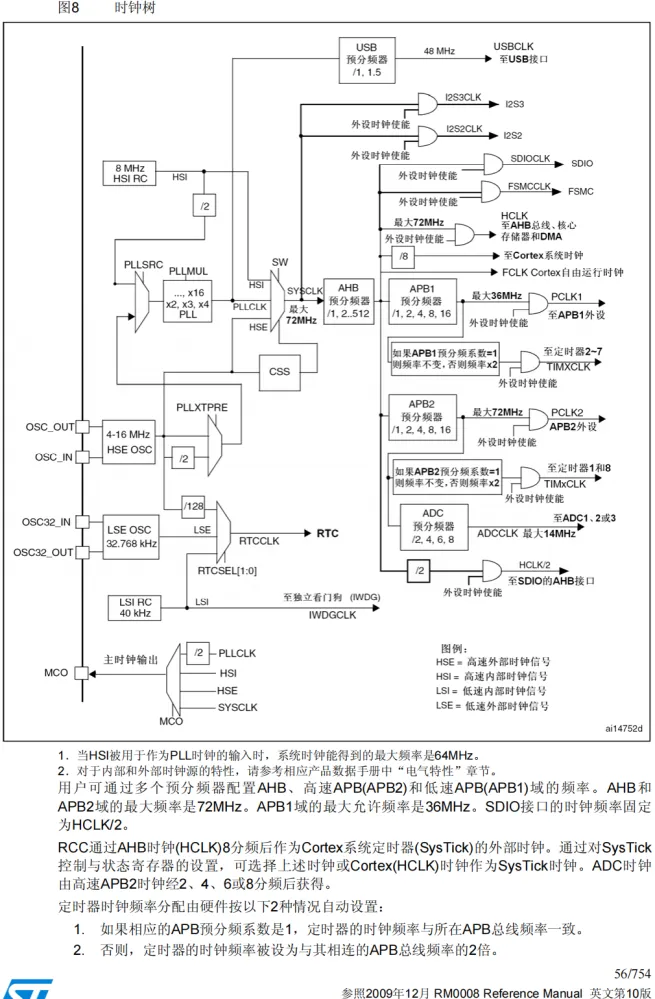

## TIM定时器[中断](中断.md)

### TIM简介

- 定时器可以对输入的时钟进行计数（**定时器本质是个计数器**），并在计数值达到设定值时触发中断。是STM32中功能最强大、结构最复杂的外设。  
- 16位计数器、预分频器、自动重装寄存器的**时基单元**，在72MHz计数时钟下可以实现最大59.65s的定时。不仅具备基本的定时中断功能，而且还包含**内外时钟源选择、输出比较、输入捕获、主从触发模式、编码器接口**等多种功能。
- STM32支持级联模式（一个定时器的输出当做另一个定时器的输入），一个定时器59.65s定时，级联一个（59.65 x 65536^2）定时8千年，级联两个（59.65 x 65536^4）定时34万亿年。
- 根据复杂度和应用场景分为了高级定时器、通用定时器、基本定时器三种类型。库函数中出现TIM9/10/11的定时器一般用不到。还有总线的连接，**RCC开启时钟的时候要注意编号数字**。功能如下所示：

| 类型    | 编号                  | 总线   | 功能                                                 |
| ----- | ------------------- | ---- | -------------------------------------------------- |
| 高级定时器 | TIM1、TIM8           | APB2 | 拥有通用定时器全部功能，并额外具有重复计数器、死区生成、互补输出、刹车输入等功能           |
| 通用定时器 | TIM2、TIM3、TIM4、TIM5 | APB1 | 拥有基本定时器全部功能，并额外具有内外时钟源选择、输入捕获、输出比较、编码器接口、主从触发模式等功能 |
| 基本定时器 | TIM6、TIM7           | APB1 | 拥有定时中断、主模式触发DAC的功能                                 |

每个型号的单片机的资源不同，操作不存在的外设不会起作用。

STM32F103C8T6定时器资源：TIM1（一个高级）、TIM2、TIM3、TIM4（三个通用）。

### 定时器结构图

#### 基本定时器

基本流程：基准时钟——预分频器——计数器——产生中断/事件——中断优先级——CPU

**时基单元**：与分频器之前就是基准计数时钟的输入，连接到了内部时钟，其频率一般是系统主频72MHz，然后与分频器可以对其进行分频（是十六位的，可以分0~65535频，分频的目的是降低频率便于改变计算，使得外设间互不干扰，控制其工作速度，匹配外设要求，有的外设是检测不到72M这么快的速度的）。计数器对分频后的时钟单位进行计数，重装载寄存器保存设定的数值，计数过程二者不断比较，达到设定目标值（0~65535）时候，就会产生中断并清零计数器。  
向上的小箭头表示可以产生中断，计数值的中断称为更新中断，中断后通往NVIC，所以接下来配置其定时器通道，就可以得到CPU响应。向下的箭头表示更新事件，更新事件不会触发中断，但是可以触发内部其他电路的工作。  
**主模式触发DAC功能**：STM32的特色主从触发模式，**可以让内部硬件在不受程序控制下实现自动运行**，极大的减轻CPU的负担。因为上图中如果在定时器产生的中断中去控制DAC的输出，此时主程序会被频繁中断，占用CPU资源，影响到程序的运行和其他中断的响应。所以使用主模式，产生的中断事件映射到出发输出TRGO的位置，使其控制输出DAC，这样便不需要在中断里触发DAC转换了。

#### 通用定时器

定时器计数方式：

向上自增（**从0开始增加，常用**）

向下自减（从设定值开始）

中央对齐模式（先从零开始再从设定值开始）

基本定时器只有向上自增一种方式，其余类型的定时器三种模式均有

时钟源输入：

基本定时器只能是内部的时钟源，但是通用定时器可以多选择**外部时钟源信号**。 

外部时钟输入模式2的输入：可以走**ETR通道**。经过滤波整形电路，输出基准时钟

外部时钟输入模式1的输入：可以选择**ITR信号**，这部分信号是来自于其他定时器。TRGO接到**其他定时器**的同时又接到了ITRx上，具体连接关系可以通过表格来了解。可**用于级联**。

#### 高级定时器

**重复计数器**：控制计数器中断的产生，可以隔几个周期触发更新中断，相当于对输出的更新中断信号进行了一次分频。  
**DTG死区生成电路**：在框图中其前三路可以输出两个互补的PWM波输出，用于控制**三相无刷驱动**。因为其只需要三路，因此第四路没什么变化。在开关切换的瞬间，由于器件的不理想，造成短暂的直通现象，因此在输出之前加上了死区生成电路，在开关切断的瞬间，产生一定时间的死区，让桥臂的上下管全都关断，防止直通现象。  
刹车输入：给电机驱动提供安全保障，如果外部引脚产生了刹车信号，或者内部时钟信号消失，控制电路就会自动切断电机的输出，防止意外。

## 时基单元相关时序分析

### 预分频器时序

当与分频器CNT_EN使能时候，计数器时钟才运行，但定时器仍然过了一段时间才发生改变，其改变的位置处于计数器寄存器清零部分，可知其重装值为FC，同时也会产生一个更新事件。

影子寄存器：后三行时序是一个**缓冲机制**，在计数周期过程中改变预分频系数，并不会直接改变定时器计数，而是等待计数周期结束后，产生了更新事件，此时预分频寄存器的值才生效，保障了稳定。  
**计数器计数频率**：CK_CNT=CK_PSC/(PSC+1)

### 计数器时序

**定时器溢出频率**：CK_CNT_OV=CK_CNT/(ARR+1)=CK_PSC/(PSC+1)/(ARR+1)

同样的，也存在缓冲机制。注：**框图中的寄存器带有阴影的都是这样的缓冲机制，用或者不用均可自行设置**。

## RCC时钟树

时钟树是STM32用来产生和配置时钟，并且把配置好的时钟发送到各个外设的系统，是所有外设运行的基础，所以是最先要配置的东西。

### 时钟产生电路  

资源：一般使用外部晶振，比较稳定，除非精度不高可以使用内部。  

- 内部8MHz；
- 外部4~16MHz高速石英晶体振荡器，也就是晶振，一般都是接8MHz；
- 外部的32.768KHz低速晶振，这个一般是给RTC提供时钟的。
- 内部40KHz低速RC震荡期，这个可以给看门狗提供时钟。
**启动过程**：首先以内部时钟8M启动，再启动外部时钟，进入PLL锁相环进行倍频，8MHz倍频9倍，获得72MHz。（据网友所说PLL不止9倍，可以用倍频16倍，进行超频运行）  
**如果外部晶振坏了，会使用内部时钟，从外面看就会慢10倍。**  
CSS：时钟安全系统，负责切换时钟。比如先前提到的刹车系统里也有。  

### 时钟分配电路  

默认情况下，无论是什么定时器，其内部基准时钟都是72MHz。如果更改了系统初始化函数SystemInit()的配置，需要重新计算速度。  

