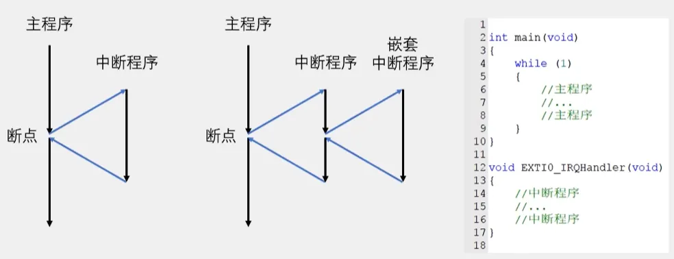
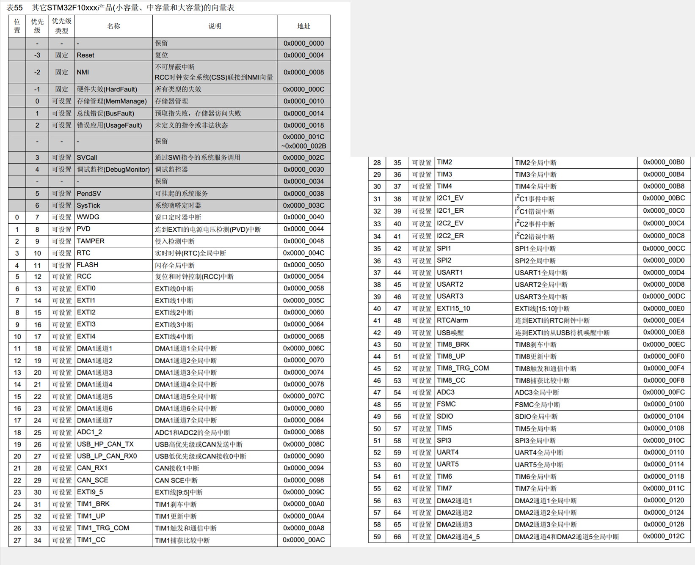
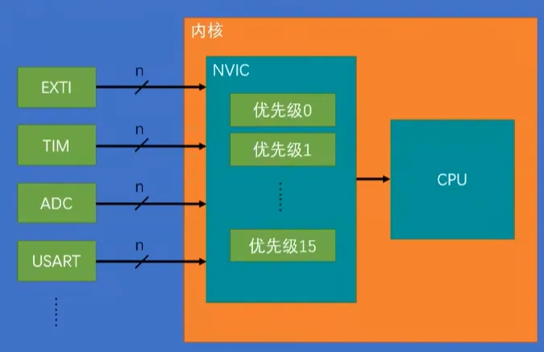
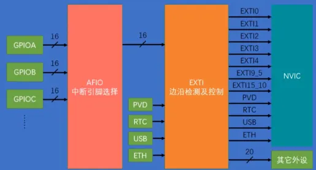
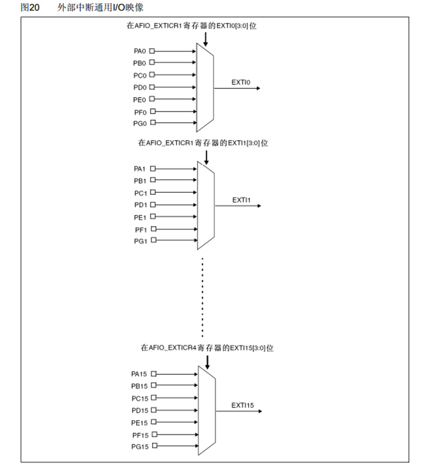
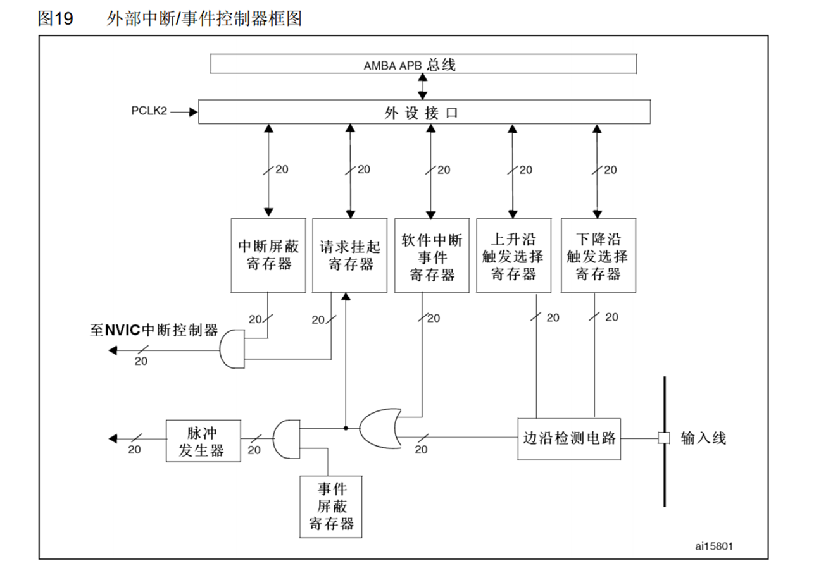

## 中断系统

### 中断的概念

**中断**︰在主程序运行过程中，出现了特定的中断触发条件（中断源)，**使得CPU暂停当前正在运行的程序**，转而去处理中断程序，处理完成后又返回原来被暂停的位置继续运行。
**轮询**：如果没用中断，那CPU总是询问有没有事件的发生，就没法干其他活了，也只能靠delay来延时。有了中断之后，CPU可以专心执行当前程序，有中断时候就才去执行中断，不用询问，提高了效率。

**中断优先级**︰当有多个中断源同时申请中断时，CPU会根据中断源的轻重缓急进行裁决，优先响应更加紧急的中断源。
**中断嵌套**︰当一个中断程序正在运行时，又有新的更高优先级的中断源申请中断，CPU再次暂停当前中断程序，转而去处理新的中断程序，处理完成后依次进行返回。

中断不需要调用，当中断来临时，由硬件自动调用这个函数

### STM32的中断

68个**可屏蔽中断通道(中断源)**，具体以手册为准，包含**EXTI、TIM、ADC、USART、SPI、12C、RTC**等多个外设，几乎所有外设都能申请中断。

使用**NVIC**统一管理中断，每个中断通道都拥有16个可编程的优先等级，可对优先级进行分组，进一步设置**抢占优先级**和**响应优先级**。

下图灰色是**内核中断**一般用不到。

我们程序当中的中断函数的地址是不确定的，是编译器自动分配的。但是我们的中断跳转，由于是硬件的限制，只能跳到固定的执行程序。所以为了能让硬件能跳转到不固定的硬件函数里，这里就需要在内存中定义一个地址的列表即——**中断向量表**。当中断发生后，就跳到这个固定位置。然后由编译器，在加上一条跳转到中断函数的代码。

### NVIC中断优先级的结构

因为STM32的中断很多，如果外部中断直接连接到CPU，CPU就会多出很多引脚。所以二者之间就有一个NVIC出现了。用于排列中断执行的优先级，STM32任何时候都是优先级高的先响应。

### NVIC优先级分组

NVIC的中断优先级由优先级寄存器的 **4位（0~15)** 决定，这4位可以进行切分，分为高n位的抢占优先级和低4-n位的响应优先级。

| 分组方式 | 抢占优先级      | 响应优先级      |
| ---- | ---------- | ---------- |
| 分组0  | 0位，取值为0    | 4位，取值为0~15 |
| 分组1  | 1位，取值为0~1  | 3位，取值为0~7  |
| 分组2  | 2位，取值为0~3  | 2位，取值为0~3  |
| 分组3  | 3位，取值为0~7  | 1位，取值为0~1  |
| 分组4  | 4位，取值为0~15 | 0位，取值为0    |

## EXTI外部中断

### EXTI简介

EXTI可以监测指定GPIO口的电平信号，当其指定的GPIO口产生电平变化时，EXTI将立即向NVIC发出中断申请，经过NVIC裁决后即可中断CPU主程序,使CPU执行EXTI对应的中断程序

**支持的触发方式**：上升沿/下降沿/双边沿/软件触发
**支持的GPIO口**：所有GPIO口，但相同的Pin不能同时触发中断
**通道数**：16个GPIO_Pin **（主要）** ，外加PVD输出、RTC闹钟、USB唤醒、以太网唤醒
**触发响应方式**：
1.中断响应（向CPU申请中断，让其执行中断函数，会触发中断引脚电平）
2.事件响应（STM32对外部中断增加的一种额外的功能，当外部中断检测到引脚电平变化时，正常的流程是选择触发中断，但在STM32中也可以触发一个事件，这种触发的外部信号不会通向CPU了，**也就是不会触发中断**，而是触发其他外设的操作，触发ADC、触发DMA。）
因为**NVIC是内核外设**，所以数据手册要去内核手册寻找。

### EXTI基本结构

引脚比较多，每一个GPIO都有16pin的话，那外部中断的GPIO就的主要通道就不够了，所以这里会有一个，**AFIO数据选择器**，它可以在这前面3个GPIO外设的16个引脚里选择其中一个连接到后面或的通道里，前面提到，相同的pin不能同时触发中断。**这是因为经过AFIO进行选择后只能有一个接到EXTI的通道上**。

然后另外的四个（PVD/RTC/USB/ETH）蹭网的也接入进来，一共组成了EXTI的20个输入信号。

然后进一步的分成了两种输出信号，一种的NVIC输出中断信号，其中的9~5会触发同一个函数，15~10也会触发同一个中断函数，编程的时候需要根据标志位来确定到底是哪一个中断函数。一种是其他外设的输出信号，有20条线。

### 内部电路

AFIO复用IO口电路：一系列的数据选择器。在STM32中，AFIO主要完成两个任务：**复用功能引脚重映射、中断引脚选择**。

EXTI框图

### 旋转编码器

触点型：单向输出和两相正交输出的区别，（金属盘经过设计）正传和反转会产生一个与原波形相差90度的相位差，通过看波形是滞后还是超前，就可以判断旋转方向。

**不推荐使用中断来处理摁键，因为不好消抖处理**。对于按键来说，它输出的波形也不是转瞬即逝的，所以要求不高的话可以在主程序中循环读取（**轮询**），如果不考虑循环读取的话，可以考虑定时器中断读取的方式，这样既可以做到后台读取按键值、不阻塞程序，也可以很好的处理按键抖动的问题。
