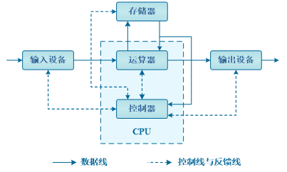
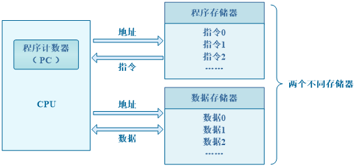
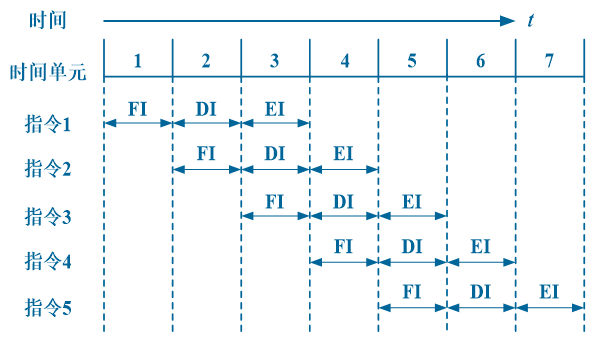
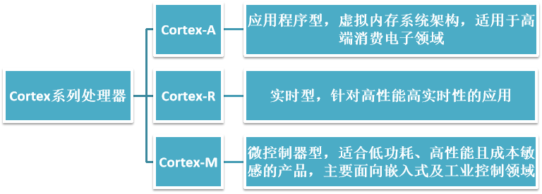
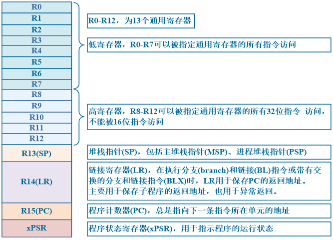
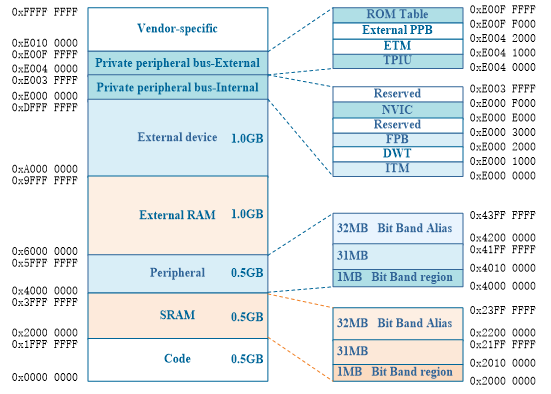

## 嵌入式系统概述

8位机（51单片机）

16位机（PIC、MSP430等）

高性能的32位机（STM32、LPC2000等）

## ARM Cortex-M3内核与STM32微控制器

### 冯诺依曼结构与哈佛结构

冯诺依曼计算机结构框图

- 计算机由==运算器、控制器、存储器、输入设备和输出设备==五大部件组成

- ==指令地址和数据地址指向同一个存储器的不同物理位置==，统一编址，宽度相同。
- 由于指令和数据放在同一个存储器中，因此冯诺依曼结构的计算机==不能同时既取指令又取数据==

哈佛体系结构框图

- 指令存储器和数据存储器独立编址、独立访问
- ==数据和指令分别存储在两个独立的存储器中==
- ==使用两条独立的总线分别与CPU进行信息交换==
- ==数据和指令的存储可以同时进行==
- 容易实现指令流水。

### ARM存储模式

[大端小端](../../嵌入式/大端小端.md)

### 流水线技术

ARM Cortex-M3微控制器采用的三级流水线：取指—译码—执行

- 取指（FI）：将指令从存储器中取出
- 译码（DI）：对所取到的指令进行翻译
- 执行（EI）：执行指令

每条指令分解为多步，并让各步操作重叠，从而实现几条指令并行处理的技术，称为流水线技术。

三级流水时序图

### ARM体系结构

### Cortex-M3内核

Cortex-M3是基于ARMv7-M体系结构设计的32位的处理器内核

==数据宽度、寄存器位数和存储器位数都是32位的==

采用基于==哈佛结构==的==三级流水线==内核

拥有==独立的数据总线和指令总线==

数据总线和指令总线==共享一个存储器空间==，总的寻址空间为4GB

- Cortex-M3微处理器
    - Cortex-M3内核
        - 中央处理器核心（Cortex-M3 Core）
            - 包括指令提取单元、译码单元、寄存器组和ALU等
        - 嵌套向量中断控制器（NVIC）
            - 用于实现快速、低延迟的异常中断处理
        - 系统时钟（SYSTICK）
            - 24位倒计时计数器，可作为系统定时器，用于产生定时中断
        - 存储器保护单元（MPU）
            - 用于对存储区域的访问保护，防止用户程序破坏存储区域的关键数据
        - 总线矩阵（AHB互连网络）
            - 用来将处理器内核和调试接口连接到不同功能的外部总线上，提供并行数据传输功能，还提供附加数据传送功能
    - 调试系统
        - 串行线/串口JTAG调试端口（SW-DP/SWJ-DP）
        - 基于AHB总线的通用调试接口（AHB-AP）
        - 嵌入式跟踪单元（ETM）
        - 数据观察点触发器（DWT）

### 寄存器

寄存器有两大类：

- ==CPU内部的寄存器==，比如Cortex-M3中的通用寄存器R0、R15(PC)等，
- ==外设I/O接口中的寄存器==，I/O接口与存储器统一编址，通过软件编程对寄存器进行读或者写操作，即可实现对外设的控制
ARM Cortex-M3微处理器:

- 13个32位的通用寄存器R0~R12
- R13、R14和R15三个寄存器被指定了专门的用途

### 存储结构

ARM Cortex-M3系列微处理器采用==存储器与I/O设备（外设）统一编址==的方式，设置部分存储器地址范围用于外设的访问，将这种通过存储器地址访问外设的方式，称为==存储器地址映射==。

存储器映射，就是将==芯片中或芯片外的FLASH、RAM和外设接口等进行统一编址，用于程序存储、数据存储、寄存器和外设==。

### 中断与异常（NVIC）

打断程序正常执行顺序的事件，都被称为异常（exception）。

中断一般指来自外部的片上外设或外扩的外设的中断请求事件。

Cortex-M3内核可支持256种异常和中断:

- ==中断编号1~15为系统异常==
- ==大于等于16的则全是外部中断，共240个外部中断==
- 通常外部中断写作IRQs， Cortex-M3具有256级的可编程中断优先级设置，功能十分强大。

| 编号   | 类别                           | 优先级    | 优先级类型 | 说明                               |
| ---- | ---------------------------- | ------ | ----- | -------------------------------- |
| 0    | N/A                          | N/A    |       | 没有编号为0的异常，此为正常状态                 |
| 1    | 复位（Reset）                    | -3(最高) | 固定    | 复位                               |
| 2    | NMI                          | -2     | 固定    | 不可屏蔽中断（来自外部NMI输入脚）               |
| 3    | 硬（Hard）Fault                 | -1     | 固定    | 只要FAULTMASK没有置位，硬Fault服务例程会被强制执行 |
| 4    | 存储器 Fault                    | 0      | 可编程   | MPU访问违例以及访问非法位置均可引发              |
| 5    | 总线Fault                      | 1      | 可编程   | 总线收到了错误响应，                       |
| 6    | 用法Fault                      | 2      | 可编程   | 由于程序错误导致的异常。                     |
| 7-10 | 保留（Reserved）                 | 保留     | 保留    | 保留                               |
| 11   | SVCall                       | 3      | 可编程   | 执行系统服务调用指令（SVC）引发的异常             |
| 12   | 调试监视器  （Debug Monitor） | 4      | 可编程   | 调试监视器（断点、数据观察点、或是外部调试请求）         |
| 13   | Reserved                     | N.A.   | N.A.  | 保留                               |
| 14   | PendSV                       |        | 可编程   | 为系统设备而设的“可挂起请求”                  |
| 15   | SysTick                      |        | 可编程   | ==系统滴答定时器==                      |
| 16   | Interrupt #0                 | 7      | 可编程   | ==外部中断#0==                       |
| …    | … …                          | … …    | 可编程   | … …                              |
| 256  | Interrupt #239               | 247    | 可编程   | 外部中断#239                         |

Cortex-M3内核集成了一个外设——NVIC用于专门负责中断。

NVIC具有以下特性

- ==可嵌套中断支持==，即高优先级的中断可以打断低优先级的中断。
- ==向量中断支持==，缩短中断延迟时间。
- ==动态优先级调整支持==。软件可以在运行期间更改中断的优先级。
- 引入新特长新技术，中断延迟大大缩短
- ==中断可屏蔽==
- 在NVIC中，==优先级的数值越小，则优先级越高==

### STM32总线结构

总线是各种信号线的集合，是嵌入式系统中各部件之间传送数据、地址和控制信息的公共通路。
与总线相关的参数
- 总线宽度：总线能同时传送的数据位数（bit），如32位
- 总线频率：总线的工作速度，频率越高，速度越快
- 总线带宽＝总线宽度×总线频率/8单位为MBps
嵌入式系统中常用的总线
- CAN总线SPI总线PCI总线ISA总线I2C总线

