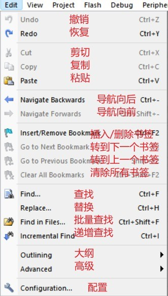

## 2 主界面详解

### 2.1 主界面概述

初学者一打开 MDK 是不是人都傻了，有这么多东西，不过不用担心，今天肯定给大家介绍清楚。先给大家简单介绍一下主界面的各个分区，MDK 主要由 菜单栏、工具栏、编辑窗口、信息窗口 四个分区组成，如下图所示：

下面给大家详细介绍这四个分区的作用都是啥。

### 2.2 菜单栏详解

#### 2.2.1 File（文件）

File 菜单主要是文件相关操作，比如新建、打开、关闭、保存等等，相信大家玩了这么久的 Windows 电脑，对这个菜单一定不陌生，几乎所有软件的 File 菜单都大同小异。

#### 2.2.2 Edit（编辑）

#### 2.2.3 View（视图）

#### 2.2.4 Project（工程）

#### 2.2.5 Flash（烧录）

#### 2.2.6 Debug（调试）

#### 2.2.7 Peripherals（外部设备）

外部设备是仿真用的，我这里没有连接外部设备，所以没显示。

#### 2.2.8 Tools（工具）

PC-Lint 是一款静态代码检测工具，需要另外安装。

#### 2.2.8 SVCS（软件版本管理系统）

SVCS（ softwate version control system ），软件版本管理系统。

#### 2.2.9 Windows（窗口）

#### 2.2.10 Help（帮助）

### 2.3 工具栏详解

我将从左到右，从上到下，分区介绍，每个的功能和快捷键。

#### 2.3.1 文件操作

新建文件 Ctrl + N 打开文件 Ctrl + O 保存当前文件 Ctrl + S 保存所有文件 没有快捷键 剪切 Ctrl + X 复制 Ctrl + C 粘贴 Ctrl + V

#### 2.3.2 文件编辑与跳转

撤销编辑 Ctrl + Z 恢复编辑 Ctrl + Y 跳转到上一步 Ctrl + - 跳转到下一步 Ctrl + Shift + -

#### 2.3.3 书签

添加书签 Ctrl + F2 跳转到上一个书签 Shift + F2 跳转到下一个书签 F2 清空所有书签 Ctrl + Shift + F2

#### 2.3.4 选中行操作

插入缩进（Tab） Tab 取消缩进（Tab） Shift + Tab 注释选中行 没有快捷键 取消注释 没有快捷键

#### 2.3.5 查找操作

查找所有文本 Ctrl + Shift + F 查找文本输入框 查找单个文本 Ctrl + F 增加搜索 Ctrl + I

#### 2.3.6 调试

打开/关闭调试 Ctrl + F5 插入断点 F9 失能单个断点 Ctrl + F9 失能所有断点 没有快捷键 取消所有断点 Ctrl + Shift + F9

#### 2.3.7 窗口与配置

窗口 没有快捷键 配置 没有快捷键（这个符号也称「扳手」，常用）

#### 2.3.8 编译与下载

编译当前文件（单个） Ctrl + F7 编译目标文件（修改过的） F7 编译所有目标文件（重新编译） 没有快捷键 编译多个工程文件（多工程） 没有快捷键 停止编译 没有快捷键 下载程序 F8

#### 2.3.9 工程选项

工程目标选择框 工程目标选项（配置） Alt + F7（这个符号也称「魔术棒」，常用）

#### 2.3.10 工程管理

都没有快捷键

单工程管理（这个符号也称「品」，常用） 多工程管理 管理运行时环境 选择软件包 安装软件支持包

## 3 工程配置详解

首先点开「魔法棒」，Options for Target。我会逐个介绍每个配置。

### 3.1 Device（设备）

### 3.2 Target（目标）

1：晶振频率。主要用于仿真调试用，一般使用硬件调试可以不用管这个值。

2：操作系统。是否选择 Keil 自带的 RTX 操作系统，一般都不选。

3：系统预览文件。我一般是默认使用系统自带，不选择自己定义的。

4：使用交叉模块优化、使用微库。交叉模块一般我不使用，微库常用于 printf 函数。

5：ROM 存储地址。这里的 ROM 存储指的是程序储存的地址，分片外和片内两种。

6：RAM 存储地址。RAM 存储地址和 ROM 道理一样，可以分片内和片外。常见例子"外部 SRAM 作为运行内存"。

### 3.3 Output（输出）

1：输出路径。在编译的过程中，输出这些文件保存的文件夹。Keil V5 一般默认是保存在 Objects 文件夹下面，使用默认路径就好。Objects 文件夹的内容可以全部删除，备份代码的时候就可以删掉。

2：输出可执行文件名。用于定义输出的可执行文件和库的名称。像是我们常见的 HEX 文件。

3：输出可执行文件。它和输出库（4）是二选一，选择了输出可执行文件就不能选择输出库。

- Debug Infomation：输出调试信息。勾这个才能调试。
- Create HEX File：输出可执行 Hex 文件。不勾可就不输出 Hex 文件咯。
- Browse Information：输出浏览信息。勾这个才能用「go to definition of」，定位定义位置，可跳转到 4.2.2 看详细介绍。

tips：默认是只勾前两个，如果不勾第三个输出，编译就会很快，快两到三倍左右，看自己选择了。

4：输出库。输出的是静态库，并非动态库。

### 3.4 Listing（链接）

1：选择列表文件输出的文件夹。可设置文件页面的宽度，长度。

2：勾选上会输出汇编列表信息（产生后缀为 lst 的文件）。如果工程中没有汇编文件，则不会输出。

3：C 编译程序列表选项，勾选上可生成 txt , i 文件。

4：可选择生成或禁止生成 .map 文件。可设置生成代码的详细信息。可选择性的选取输出 MAP 文件。

### 3.5 User（用户）

1：可设置在 Compile 前、Build 前、Build 后要运行的程序。

2：Run 'After-Build' Conditionally：只运行 'After-Build' 。

​ Beep When Complete：编译完成后发出「Beep」。

​ Start Debugging：启动调试程序。

### 3.6 C/C++

1：预处理。做预定义，相当于在程序中的 `#define`。

2：语言代码生成。可以理解成 Complie、Build 到最后生成代码，用于优化代码大小和运行速度。

3：可设置包含路径、多功能控件，查看编译器控制字符串。

### 3.7 Asm

1：有条件地装配控制符号。用于设置汇编条件

2：语言代码生成。

- Read-Only Position Independent：为常量生成独立的代码空间。
- Read-Write Position Independent：为可读写代码生成独立的代码空间。
- Thumb Mode：Thumb 模式。
- No Warnings：不警告。
- Execute-only Code：只执生成行代码。
- Split Load and Store Multiple：加载和存储多个分裂。
- No Auto Includes：不自动添加头文件。

3：可设置包含路径、多功能控件，查看装配控制字符串。

### 3.8 Linker（连接器）

1：使用分散文件加载对话框Target页面。

- Make RW Sections Position Independent：使 RW 段独立。
- Make RO Sections Position Independent：使 RO 段独立。
- Don't Search Standard Libraries：不搜索标准库。
- Report 'might fail' Conditions as Errors：报告 'might fail' 条件认为是错误。
- X/O Base：X/O基地址。
- R/O Base：R/O基地址。
- R/W Base：R/W基地址。
- disable Warnings：警用警告。

2：分散文件。可以加载、查看、编辑分散文件。

3：可设置多功能控件，查看连接器控制字符串。

### 3.9 Debug（调试）

1：配置硬件仿真。选择并配置自己的下载调试器。

2：配置模拟仿真，也叫软件仿真。

​ Limit Speed to Real-Time：将 CPU 模拟的速度限制为实时。此设置仅对模拟速度快于实时的目标有用。

3：Load Application at Startup：将在 Options for Target \> Output \> Name of Executable 名称字段中指定的目标文件加载到 uVision 调试器中。

​ Run to main()：执行指令直到到达 main() 并停止执行。禁用时，应用程序在第一条指令处停止。无论此选项如何，都会执行初始化文件中定义的命令。

​ Initialization File：指定可以包含 Debug Commands,Debug Functions，调试器配置设置和设备初始化命令的文件。

4：Restore Debug Session Settings：恢复在先前调试会话中为断点、观察窗口、性能分析器、内存窗口、工具箱和系统查看器定义的设置。

5：DLL：软件仿真和硬件仿真都需要使用动态库，动态库文件保存在 MDK 安装目录的 ARM\\BIN 下面。

### 3.10 Utilities

1：配置 FLASH 菜单。二选一，我一般用上面的 "Update Target Driver for Flash Programming"。

- Use Debug Driver：使用调试驱动。
- Update Target Before Debugging：调试之前更新项目。
- Setting：设置。很多初学者没有勾选 "Setting" 里的 "Reset and Run" （复位并运行），导致烧好的板子要按一下复位才运行。

2：配置图像文件处理。

## 4 使用技巧

给大家介绍一些 MDK5 的使用技巧，希望对大家有帮助，设置好后记得点 OK ，才会生效哦。

### 4.1 文本美化

#### 4.1.1 编辑器设置

将 tab 键设置为 4 个空格，这样代码拷贝代码到其他地方，格式就不会乱，不会出现对不齐的情况。

#### 4.1.2 字体和颜色设置

大家可以按自己的喜好去自定义这些设置，这里是以 C/C++ 文件的数字设置为例。

#### 4.1.3 用户关键字设置

设置好关键字后，关键字在代码里会高亮。

#### 4.1.4 代码提示与语法检测

设置好以后就是这样的效果：

#### 4.1.5 设置保存

global.prop 文件，用于保存设置，在 "XXX\\UV4\\global.prop" 的路径下。

设置好后，建议把这个文件保存下来，如果你重装 MDK5 或者换了一台电脑，就可以用保存好的 global.prop 文件替换掉新的，就可以恢复原本设置。

### 4.2 代码编辑技巧

#### 4.2.1 tab 键技巧

tab 键刚刚已经设置成了 4 个空格，搭配上 2.3.4 提到的插入缩进、取消缩进，就可以快速规范和整理代码格式。

#### 4.2.2 定位函数或变量被定义位置

这里就要细说 3.3 提到的 Browse Information。

有两种方法定位：

- 选中函数/变量 + 右键 + 选 "Browse Information" 。
- 选中函数/变量 + F12。

#### 4.2.3 快速注释与取消注释

各有两种方式。

快速注释：

- 选中要注释的代码 + 右键 + 选 Advanced 的 Comment Selection
- 选中要注释的代码 + 

快速取消注释：

- 选中要注释的代码 + 右键 + 选 Advanced 的 Uncomment Selection
- 选中要注释的代码 + 

### 4.3 查找与替换

#### 4.3.1 快速打开头文件

选中要打开的头文件 + 右键 + 选 Open Document "xxx.h"。

#### 4.3.2 查找

查找可以用 Find in Files 和 Find。看情况和个人习惯选择即可。

Find in Files：

查找效果如下：

Find：查找范围可以选 Current Document （当前文件）、Selection（选中范围）、Current Project（当前项目，效果就和 Find in Files 差不多了）。

#### 4.3.3 替换

### 4.4 编译后问题的定位

我们在写代码时，编译后有 error/warning，在 Build Output（信息窗口），双击 error/warning 就可以跳转到问题位置。

建议从上到下，一个个解决 error/warning。

### 4.5 窗口视图

对于初学者来说，有时候一不小心把主界面的某个窗口关了，就再也找不到恢复位置了，关了再开窗口也不会恢复。这里教大家怎么恢复默认窗口。

### 4.6 编辑窗口字体大小

点击编辑窗口： Ctrl + 滚动鼠标，就可以调节字体大小啦。
