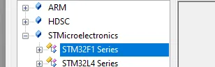
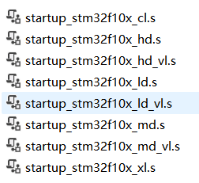
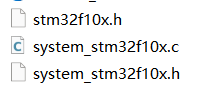
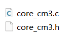
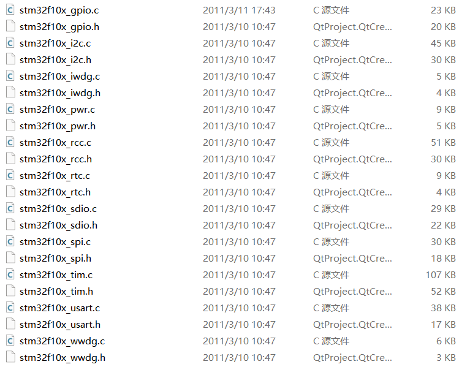
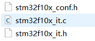
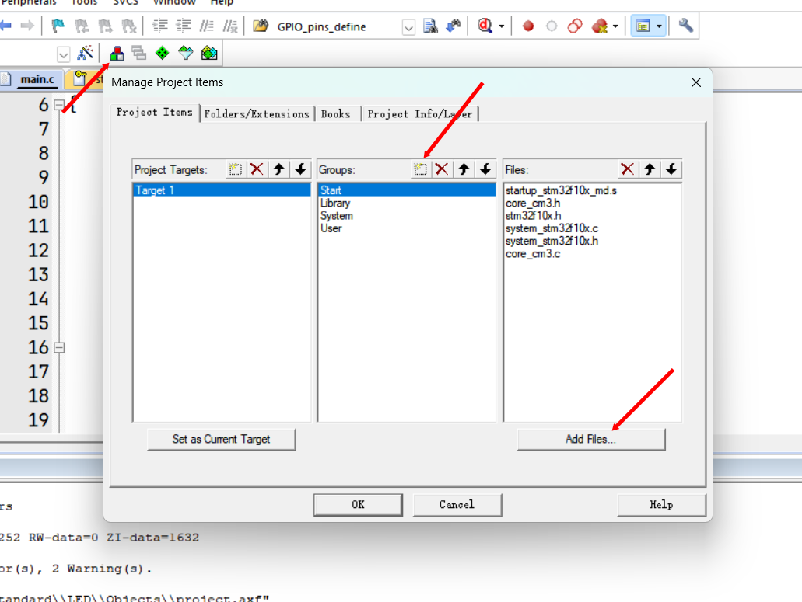
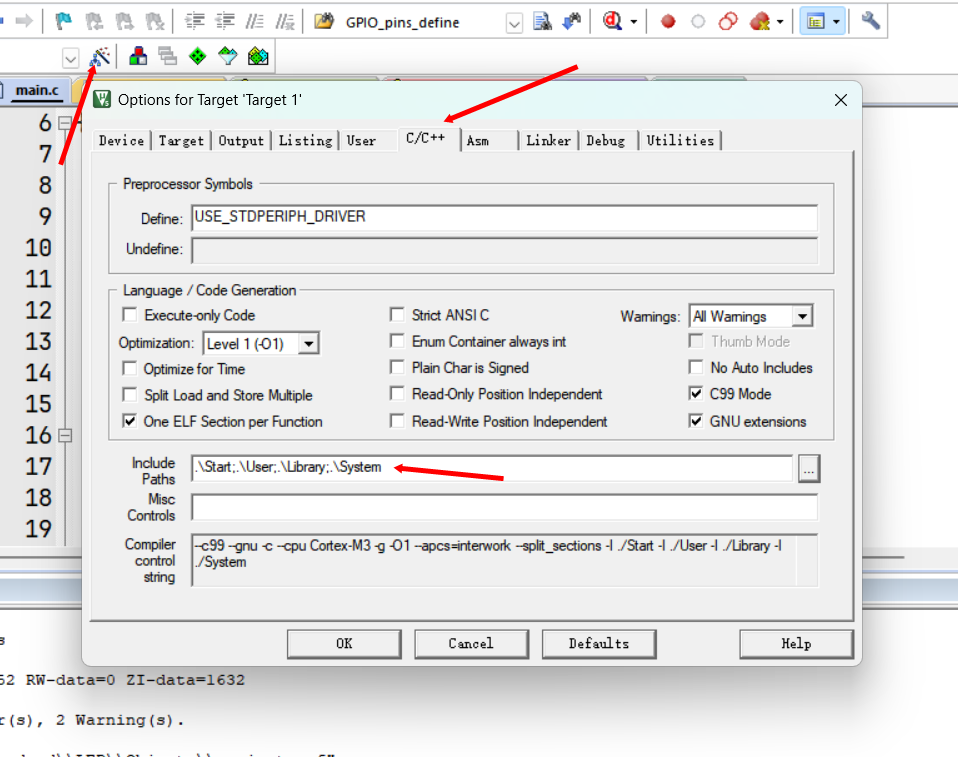
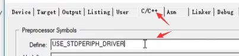

## 安装固件包

### 本地安装固件包

双击Keil.STM32F1xx_DFP.2.2.0.pack

### 在线安装固件包

## 新建工程

新建工程，新建文件夹存放工程，然后给工程起名，起一个通用的名字，比较不容易改，描述工程内容只需要改文件夹即可。这时候打开就可以选择芯片型号了。



## 项目结构

### Start

1. **启动文件**：选择md.s（中容量产品

2. **外设寄存器描述文件**

3. **内核寄存器的描述文件**：STM32是内核和内核外围的设备组成的，而且这个内核的寄存器描述和外部设备的描述文件不是在一起的，所以我么还需要添加一个内核寄存器的描述文件。


### Library

1. **标准外设驱动及其头文件**


### User

1. **conf是用来存放配置头文件的包含关系，it文件是用来存放中断函数**

2. **main.c**

### 操作

1. 将文件加入到工程。
	
2. 添加头文件路径
	
3. 复制stm32f10x.h文件的宏定义名：**USE_STDPERIPH_DRIVER**

```c
#ifdef USE_STDPERIPH_DRIVER
    #include "stm32f10x_conf.h"
#endif
```



## 编译器版本

点击魔法棒，target->ARMCompiler选择V5.06或者改为降低5版本。

添加编译器参考博客：[https://blog.csdn.net/tytyvyibijk/article/details/125589391](https://blog.csdn.net/tytyvyibijk/article/details/125589391)

## 新建工程步骤

•建立工程文件夹，Keil中新建工程，选择型号
•工程文件夹里建立Start、Library、User等文件夹，复制固件库里面的文件到工程文件夹
•工程里对应建立Start、Library、User等同名称的分组，然后将文件夹内的文件添加到工程分组里
•工程选项，C/C++，Include Paths内声明所有包含头文件的文件夹
•工程选项，C/C++，Define内定义USE_STDPERIPH_DRIVER
•工程选项，Debug，下拉列表选择对应调试器，Settings，Flash Download里勾选Reset and Run