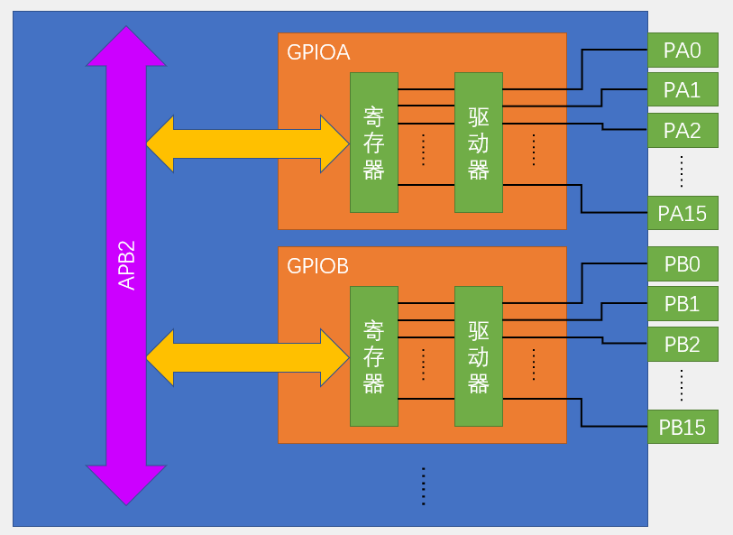
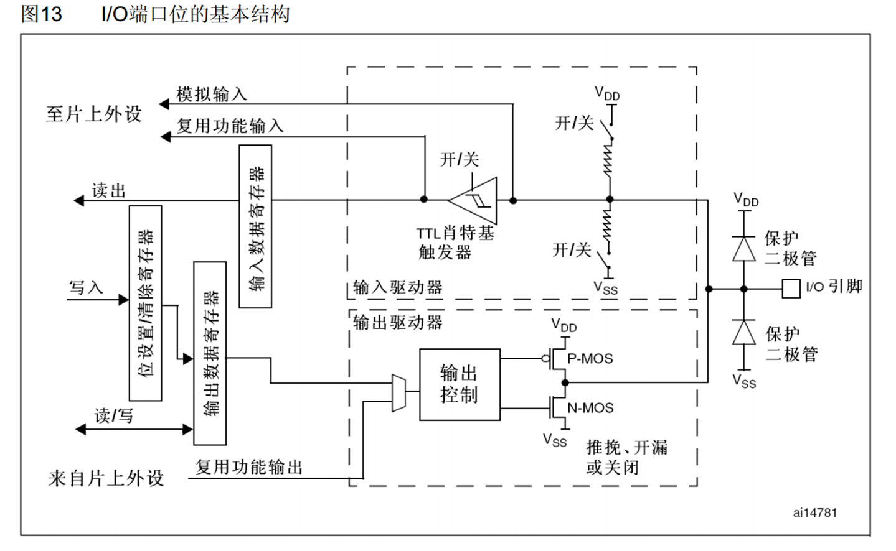
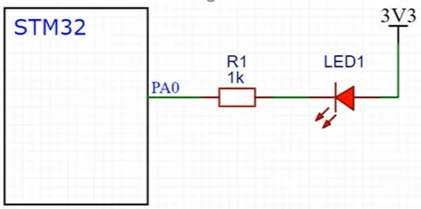
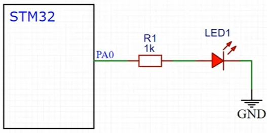
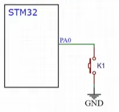
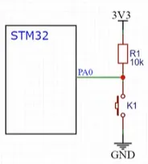
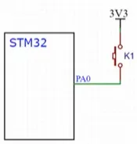
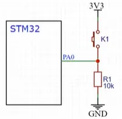

## 介绍

可配置为8种输入输出模式  
**引脚电平**∶0V~3.3V，部分引脚可容忍5V  
输出模式下可控制端口输出高低电平，用以驱动LED、控制蜂鸣器、模拟通信协议输出时序等  
输入模式下可读取端口的高低电平或电压，用于读取按键输入、外接模块电平信号输入、ADC电压采集、模拟通信协议接收数据等。

## 基本结构

全部都是挂载到外设**APB2总线**上的。

- 输入部分：  
一个引脚如果处于浮空状态，那么它的电平是**不确定**的，极易收到干扰。
因此加了上拉和下拉电阻。
这里的电阻阻值还是比较大的，所以是一种**弱上拉和弱下拉**，不影响操作。
模电里这叫迟滞/滞回比较器，也就是施密特触发器的电路（电压变化是有抖动的，斯密特就是做了一个**范围限定，只在某个阈值高低才触发导通**。）
- 输出部分：
数字部分可以由**输出数据寄存器**或者**片上外设控制**，两种控制方式通过这个数据选择器接到数据输出控制部分。
如果选择通过输出数据寄存器进行控制，那就是普通的IO口输出。
接下来连接到一个控制输出的MOS管，控制为开漏，推挽或关闭。

想操作某一个端口而不影响其他端口，需要一些特殊方式：  
①先读出这个寄存器的值，然后按位与和按位或的方式更改某一位，最后再将更改后的数据写回去，在C语言中就是 **&=和|=** 的操作。这种方法比较麻烦，效率率不高，对于IO口而言不太合适。  
②第二方式就是设置图中的位设置/清除选择寄存器——**库函数操作**。  
③读写 **STM32“位带”** 区域，和51的位寻址作用差不多。早STM32中，专门分配有一段地址区域，这段地址**映射了RAM和外设寄存器所有的位**，读取这段地址的数据，就相当于读取所映射位置的某一位。

## GPIO8种工作模式

#import/pf 

| 模式名称   | 性质   | 特征                        |
| ------ | ---- | ------------------------- |
| 浮空输入   | 数字输入 | 可读取引脚电平，若引脚悬空，则电平不确定      |
| 上拉输入   | 数字输入 | 可读取引脚电平，内部连接上拉电阻，悬空时默认高电平 |
| 下拉输入   | 数字输入 | 可读取引脚电平，内部连接下拉电阻，悬空时默认低电平 |
| 模拟输入   | 模拟输入 | GPIO无效，引脚直接接入内部ADC        |
| 开漏输出   | 数字输出 | 可输出引脚电平，高电平为高阻态，低电平接VSS   |
| 推挽输出   | 数字输出 | 可输出引脚电平，高电平接VDD，低电平接VSS   |
| 复用开漏输出 | 数字输出 | 由片上外设控制，高电平为高阻态，低电平接VSS   |
| 复用推挽输出 | 数字输出 | 由片上外设控制，高电平接VDD，低电平接VSS   |

前三个输入一样，区别在于上拉电阻和下拉电阻的接入，定义上下拉情况。
模拟输入：**ADC转换的专属配置模式，其他时候一般用不到**。  
开漏输出/推挽输出：都是数字输出，可以控制高低电平，区别就是**开漏输出的高电平是高组态，没有驱动能力**。而**推挽输出的高低电平都是具有驱动能力**的。  
**注意：** 当配置成输出模式的时候，内部也可以顺便输入一下，没影响。  
复用推挽输出/复用开漏输出：引脚电平是由片上外设控制的。

## LED电路

限流电阻一般是要加上的，以防止电流过大。一下是两种控制LED的方式。该如何选择呢？一般是看IO口的驱动能力了，在单片机电路当中**一般是选择第一种**，因为很多单片机都采用了高电平弱驱动，低电平强驱动的方式，这样一定程度上可以避免高低电平打架。

低电平控制亮

高电平控制亮

蜂鸣器电路
使用了三极管开关驱动电路方案，三极管开关是最简单的驱动电路了。对于**功率稍微大一点的，直接用IO口驱动可能会对单片机负担过重，这时候就可以用一个三极管驱动电路**来完成驱动任务。

## 按键和传感器模块的硬件电路

下接摁键方式1

下接摁键方式2

上接摁键方式1

上接摁键方式2

一般常用**下接摁键**的方式，原因和LED的接法类似，是电路设计常用的规范。方式1必须要求引脚是上拉或下拉输入的模式；方式2可以允许引脚是浮空输入的模式，因为已经外置了上拉电阻和下拉电阻。