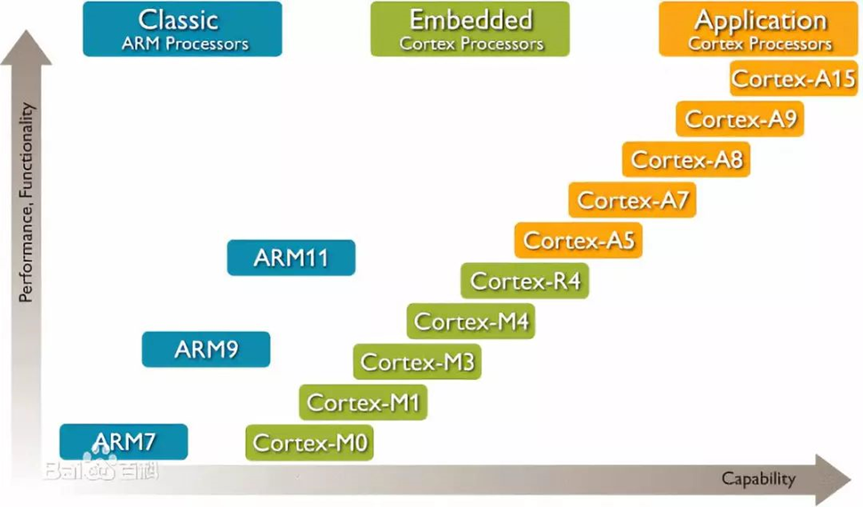
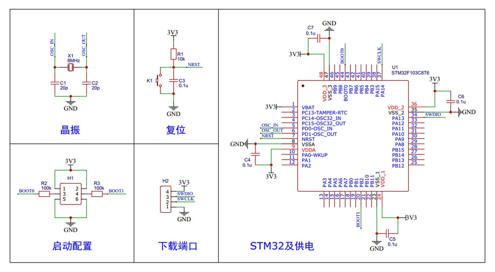

## ARM型号

## STM32F103C8T6

•系列：主流系列STM32F1
•内核：ARM Cortex-M3
•主频：72MHz
•RAM：20K（**SRAM**）
•ROM：64K（**Flash**）
•供电：2.0~3.6V（标准3.3V）
•封装：LQFP48

## **F1系列**片上资源/外设

| 英文缩写    | 名称        | 英文缩写    | 名称        |
| ------- | --------- | ------- | --------- |
| NVIC    | 嵌套向量中断控制器 | CAN     | CAN通信     |
| SysTick | 系统滴答定时器   | USB   |USB通信   |
| RCC     | 复位和时钟控制   | RTC     | 实时时钟      |
| GPIO    | 通用IO口     | CRC     | CRC校验     |
| AFIO    | 复用IO口     | PWR     | 电源控制      |
| EXTI    | 外部中断      | BKP     | 备份寄存器     |
| TIM     | 定时器       | IWDG    | 独立看门狗     |
| ADC     | 模数转换器     | WWDG    | 窗口看门狗     |
| DMA     | 直接内存访问    | DAC     | 数模转换器     |
| USART   | 同步/异步串口通信 | SDIO    | SD卡接口     |
| I2C     | I2C通信     | FSMC    | 可变静态存储控制器 |
| SPI     | SPI通信     | USB OTG | USB主机接口   |

- NVIC：内核中管理中断的，比如中断优先级  
- SysTick：主要用来给操作系统提供定时服务，当然本课程不使用操作系统，因此可以用来生成Delay函数。  
- RCC：对系统的时钟进行配置，还有就是**使能各模块的时钟**。不给时钟的情况下，操作外设是无效的，外设也不会工作，这样的目的是降低功耗。  
- [GPIO](../模块/GPIO.md)：引脚控制。  
- AFIO：复用IO口，可以完成复用功能的重定义，还有中断端口的配置。  
- [[EXTI]]：是外部中断，配置好外部中断后，当引脚有电平变化时候，就可以出发中断，让CPU来处理任务。  
- [TIM](../模块/TIM.md)：定时器，整个STM32中最常用、功能最多的外设。分为高级定时器（复杂）、通用定时器（常用）、基本定时器三种类型。生产PWM波最常用。  
- [ADC](../模块/ADC.md)：模数转换器，STM32内置了12位的AD转换器，可以直接读IO口的模拟电压值，无需外部联结AD芯片，使用非常方便。  
- DMA：是直接内存访问，这个可以帮助CPU完成搬运大量数据这样的繁杂任务。  
- [USART](../模块/USART.md)：同步或者异步串口，我们常用的UART是异步串口的意思。  
- [I2C](../模块/I2C.md)：非常常用的通信协议。STM32内置了控制器，可以用硬件来输出时序波形。使用起来更高效，当然，用通用IO口来模拟时序波形也是没有问题的。  
- [SPI](../模块/SPI.md)：非常常用的通信协议。STM32内置了控制器，可以用硬件来输出时序波形。使用起来更高效，当然，用通用IO口来模拟时序波形也是没有问题的。  
- CAN：通信协议，一般用于汽车领域。  
- USB：通信协议，生活中到处都是，可以通过STM32USB外设制作模拟鼠标，模拟U盘。  
- [RTC](RTC.md)：是实时时钟，在STM32内部完成年月日、时分秒的计时功能，而且可以接外部备用电池，即使掉点也能正常运行。 
- CRC：一种数据的校验方式，用于判断数据正确性，有了这个外设的支持，进行校验就会更方便一些。  ****
- PWR：电源控制，可以让芯片进入睡眠模式等状态。来达到省点的目的。  
- BKP：备份寄存器，一段存储器，当系统掉电，仍可用备用电池保持数据，这个根据需要可以完成一些特殊功能。  
- IWDG：独立看门狗  
- WWDG：窗口看门狗，当单片机因为电磁干扰四级或者程序设计不合理出现死循环时候，看门狗可以及时复位芯片，保证系统的稳定性。 
下面这四个C8T6没有，具体需要看手册。  
- DAC：数模转换器，可以直接在IO口输出模拟电压。  
- SDIO：是SD卡接口，可以用来读取SD卡。  
- FSMC：是可变静态存储控制器，可以用于扩展内存，或者配置成其他总线协议，用于某些硬件的操作。  
- USB OTG：用OTG功能，可以让STM32作为USB主机去读取其他USB设备。

## 命名规则

## 系统结构

## 引脚定义

有时候拿到一块芯片我们可以先看他的引脚定义，看完就大概知道这个芯片是怎么用的了。

## 启动配置

#import/dn
注意**BOOT引脚的值是在上电一瞬间有效**的，之后就随便了。

从系统存储器启动，这种模式启动的程序功能由厂家设置。
> （其中烧录的程序在出厂时就已确定，不可修改）

## 最小系统电路

【STM32供电电路】3.3V和GND之间一般连接了一个滤波电容，会让电源更加稳定，**一般遇到供电都会习惯性的加几个滤波电容**。其中VBAT是接备用电池的，是给RTC和备份寄存器使用的。
【晶振电路】接了一个8MHz的主时钟晶振，**STM32的主晶振一般都是8MHz**的，通过颞部锁相环倍频得到了72MHz的主频。连接到5、6引脚，另外还需要两个20pF的电容，作为起振电容，电容的另一端接地即可。  
如果需要RTC的话，还需要再接一个32.768KHz的晶振（OSC32），电路和这个一样，但是接在3、4号引脚。为什么是32.768KHz呢？因为32768是2的15次方，内部的RTC电路经过2^15分频就可以生成1秒的时间信号了。  
【**复位电路**】10k的电阻和0.1μF的电容组成的，提供复位信号。产生先低电平然后电容充完电又变高电平，这个低电平信号就成为了复位信号，所以一上电的瞬间就复位了。当然他提供了一个摁键，当摁键摁下的时候电容接地放电了，然后松开就会发生复位的过程，产生复位信号。  
【启动配置】拨动开关，在最小系统板上使用的是跳线帽来选择的。  
【下载端口】如果是用ST-Link下载程序的话，就需要吧SWDIO和SWCLK两个引脚印出来方便接线，GND是一定要引出来的，3.3V如果板子自己有供电的话就不用引，建议都引。
资料原理图上多了一些**稳压芯片**将5V转化为3.3V，常用的有XC6206、AMS1117。
