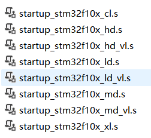
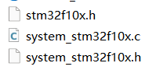
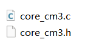
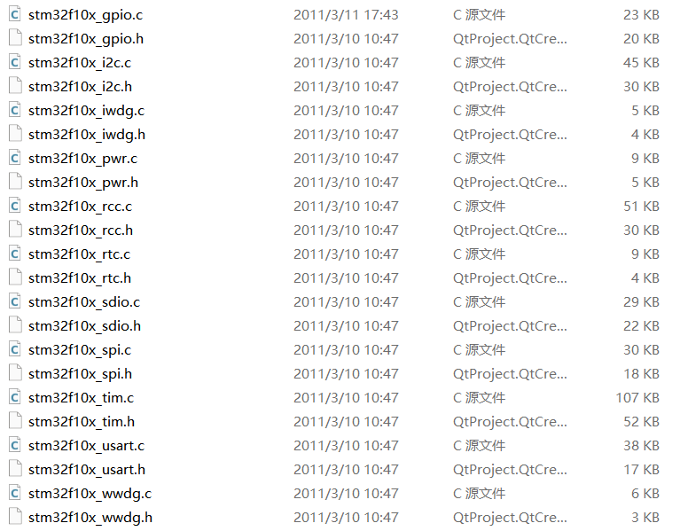
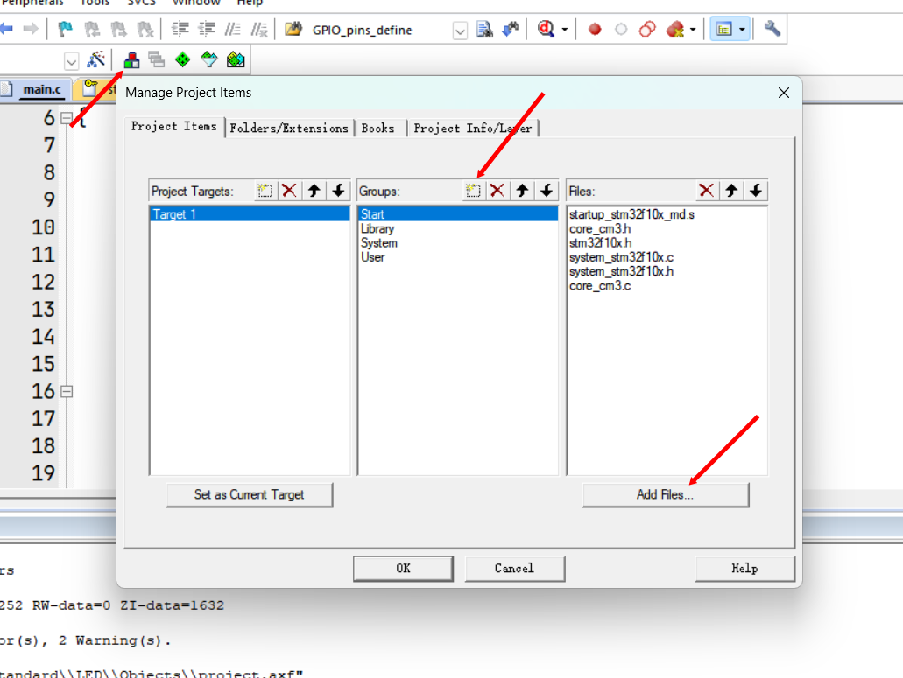
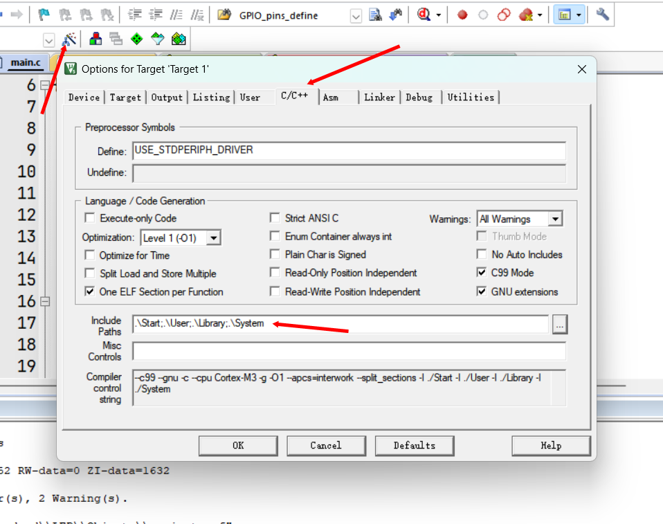
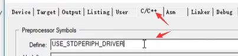

## 开始keil工程搭建  

（一开始建立的工程是不能直接用的，需要导入固件库：双击Keil.STM32F1xx_DFP.2.2.0.pack）  
打开Keil5，新建工程，新建文件夹存放工程，然后给工程起名，起一个通用的名字，比较不容易改，描述工程内容只需要改文件夹即可。这时候打开就可以选择芯片型号了。

【扩展：**在线安装固件包**】用于需要其他芯片的时候

## 项目结构

### Start

1. **启动文件**：选择md.s（中容量产品

2. **外设寄存器描述文件**

3. **内核寄存器的描述文件**：STM32是内核和内核外围的设备组成的，而且这个内核的寄存器描述和外部设备的描述文件不是在一起的，所以我么还需要添加一个内核寄存器的描述文件。 


### Library

1. **标准外设驱动及其头文件**


### User

1. **conf是用来存放配置头文件的包含关系，it文件是用来存放中断函数**

2. **main.c**

### 操作

1. 将文件加入到工程。
    
2. 添加头文件路径
    
3. 复制stm32f10x.h文件的宏定义名：**USE_STDPERIPH_DRIVER**。
```c
#ifdef USE_STDPERIPH_DRIVER
    #include "stm32f10x_conf.h"
#endif
```


## 编译器版本

点击魔法棒，target->ARMCompiler选择V5.06或者改为降低5版本。
添加编译器参考博客：[https://blog.csdn.net/tytyvyibijk/article/details/125589391](https://blog.csdn.net/tytyvyibijk/article/details/125589391)
