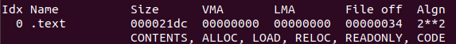
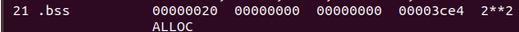

## GDB

gdbserver 192.168.11.118:1234 myprogram

## KGDB

tarrem localhost:5551
add-symbol-file ad76x6.ko 0x7f000034 -s .data 0x7f003a20 -s .bss 0x7f003ce4
kgdboc=ttymxc0,115200 kgdbwait

| .text |  |
| ----- | ------------------------------------------------------- |
| .bss  |  |
| .data |  |
