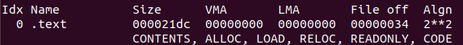
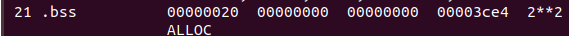

- cp myprogram /home/tronlong/WorkSpace/
- cp ad76x6.ko /home/tronlong/WorkSpace/
- 使用 NFS
  - mount -t nfs -o nolock,vers=3 192.168.11.118:/home/tronlong/WorkSpace/ /mnt
- GDB
  - gdbserver 192.168.11.118:1234 myprogram
- cd /run/media/mmcblk0p8/comtrade/sd/
- sudo ssh root@192.168.11.137
- KGDB
  - tarrem localhost:5551
  - add-symbol-file ad76x6.ko 0x7f000034 -s .data 0x7f003a20 -s .bss 0x7f003ce4
  - kgdboc=ttymxc0,115200 kgdbwait

|.text||
|------|---------------------------------------------------------------------------------|
|.bss||
|.data||

- Ubuntu(18.04LTS)和电脑之间无法复制粘贴
  - sudo apt-get autoremove open-vm-tools
  - sudo apt-get install open-vm-tools-desktop
- 登录SSH异常问题：PTY allocation request failed on channel 0
  - mount devpts /dev/pts -t devpts
  - 修改/etc/init.d/rcS取消注释#/etc/adb\_conf.sh start &
- 挂在mmcblk0p8
  - mkfs.ext4 /dev/mmcblk0p8
  - mkdir -p /run/media/mmcblk0p8
  - mount /dev/mmcblk0p8 /run/media/mmcblk0p8
- 添加全局环境变量
  - vim /etc/profile
  - // 如果只修改当前用户的环境变量，则是\`vim ~/.bashrc\`
  - // 在文件的最后一行添加以下代码：
  - export PATH=$PATH:==/home/tronlong/T113/T113-i_v1.0/out/t113_i/tlt113-minievm-emmc/longan/buildroot/host/usr/bin==
  - ==export PATH=$PATH:/opt/software/universal-ctags/bin==
  - 执行source /etc/profile
- 查看当前环境变量
  - echo $PATH
- 系统信息查询

|cat /etc/issue|系统登录欢迎信息|
|--------------|--------|
|cat /etc/hostname|主机名字|
|cat /proc/version|当前 Linux 内核版本|
|cat /etc/os-release|文件系统版本信息|
|top|当前 CPU 使用率|
|cat /proc/meminfo|内存使用情况|
|env|系统环境变量信息|

- 设备树
  - ==/home/tronlong/T113/T113-i_v1.0/device/config/chips/t113_i/configs/tlt113-minievm-emmc/==
  - /home/tronlong/T113/T113-i\_v1.0/kernel/linux-5.4/arch/arm/boot/dts/
- echo 0 > /sys/class/leds/user-led0/brightness //熄灭 LED1
- echo 1 > /sys/class/leds/user-led0/brightness //点亮 LED1
- 以覆盖方式写入文件，写入语句会覆盖目标文件原有内容，保证文件保存的始终是最新内容。
  - echo "Hello World" > hello.txt
- 以追加方式写入文件，写入语句不会覆盖目标文件原有内容，只会追加在文件末尾。追加方式适用于记录运行log，便于后期问题分析。
  - echo "Hello World" >> hello.txt
- 调试节点
  - echo 255 > /sys/module/spi\_sunxi/parameters/debug
- ==dmesg|grep spi==
  - \[ 0.173399\] spi spi1: spi1 supply spi not found, using dummy regulator
  - \[ 0.173656\] sunxi\_spi\_resource\_get()2198 - \[spi1\] SPI MASTER MODE
  - \[ 0.173719\] sunxi\_spi\_resource\_get()2236 - Failed to get sample mode
  - \[ 0.173729\] sunxi\_spi\_resource\_get()2241 - Failed to get sample delay
  - \[ 0.173739\] sunxi\_spi\_resource\_get()2245 - sample\_mode:-1431633921 sample\_delay:-1431633921
  - \[ 0.173818\] sunxi\_spi\_clk\_init()2287 - \[spi1\] mclk 100000000
  - ==[ 0.174111] spi spi1: registered master spi1==
  - ==[ 0.174378] spi spi1.0: setup mode 0, 8 bits/w, 100000000 Hz max --> 0==
  - ==[ 0.174616] spi spi1: registered child spi1.0==
  - \[ 0.174647\] sunxi\_spi\_probe()2700 - \[spi1\]: driver probe succeed, base d0821000, irq 40
- cat /sys/devices/platform/soc@3000000/4026000.spi/info
  - pdev->id = 1
  - pdev->name = 4026000.spi
  - pdev->num\_resources = 2
  - pdev->resource.mem = \[0x04026000, 0x04026fff\]
  - pdev->resource.irq = 0x00000028
  - pdev->dev.platform\_data.cs\_num = 1
  - pdev->dev.platform\_data.regulator = 0x9841c69e
  - pdev->dev.platform\_data.regulator\_id =
- spi mode: 0x0
- bits per word: 8
- max speed: 500000 Hz (500 KHz)
