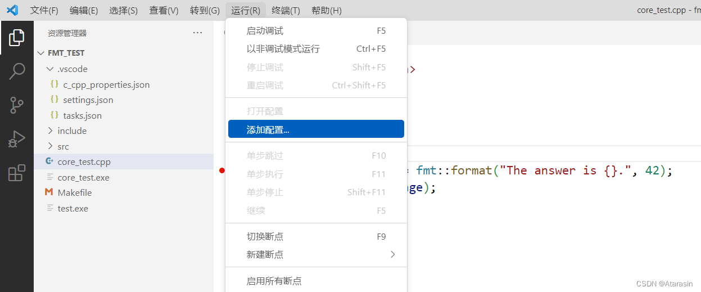

- launch.json
    - 调试器相关的配置文件。比如，调试器的路径、编译生成的可执行文件路径。
    - 注：==若源文件需要调试，编译生成可执行文件时必须加上-g选项==，否则断点无法生效。
    - 
    - 选择GDB作为调试器，然后就会生成一个配置为空的launch.json的文件。
    - "name": "test", // 修改过
    - "program": "/mnt/hgfs/SharedFolders/WorkSpaceUbuntu/test/test", // 修改过
    - "miDebuggerPath": "arm-linux-gnueabi-gdb", // 修改过
    - "miDebuggerServerAddress": "==开发板IP:1234==", // 修改过

- c_cpp_properties.json
    - 编译器路径和智能代码提示相关的配置文件。
    - 使用快捷键Ctrl+Shift+P，输入C/C++:Edit Configuration
    - 
        "name": "Linux",
        "includePath": \[
        "\${workspaceFolder}/\*\*",
        "/home/tronlong/T113/T113-i_v1.0/kernel/linux-5.4/\*\*"
        \],
        "compilerPath": "arm-linux-gnueabi-gcc",
        "cStandard": "c11"

- tasks.json
    - 编译器相关的配置文件。比如，设置编译指令。
    - 注：对于复杂的编译任务（涉及多个源文件的编译），不如直接编写[Makefile](../../../02专业学习/Makefile%20TODO/Makefile.md)文件来的方便。
    - 菜单栏选择 " Terminal/Configure Tasks"。
