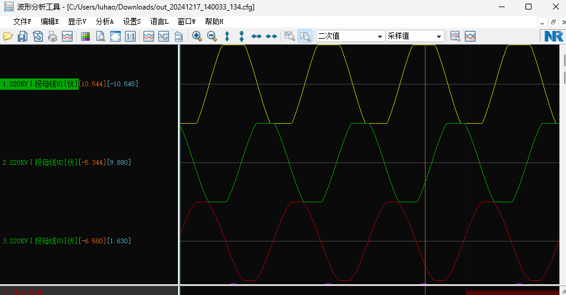
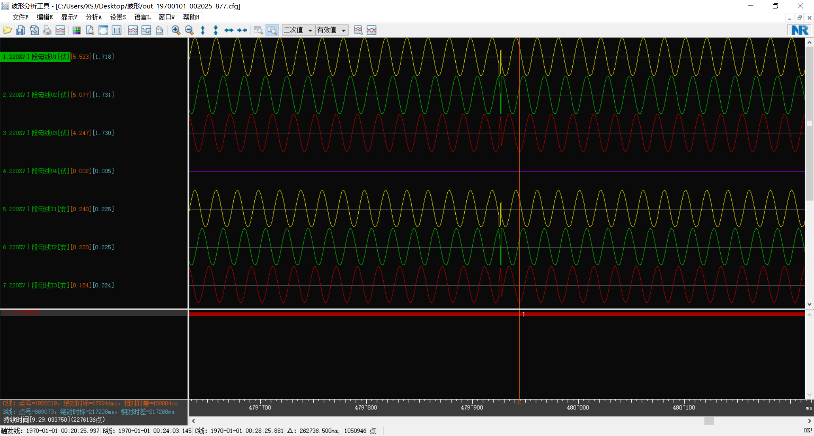
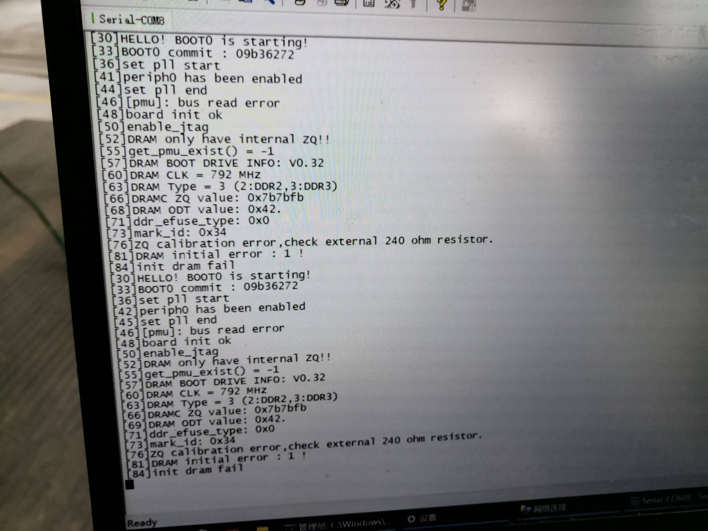
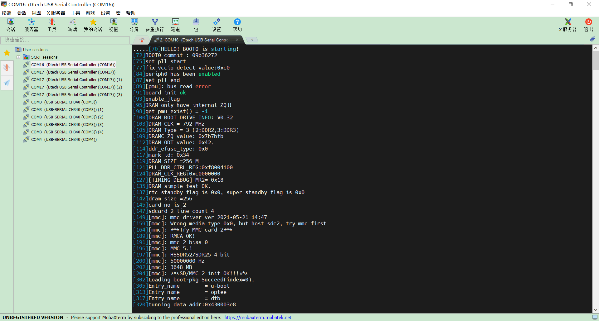

## 问题一：T113i接受不到AD7606数据

硬件调试：示波器查看T113i发送到AD7606的CONVST信号正常

示波器查看AD7606发送回T113i的BUSY信号正常

示波器查看其他信号正常

软件调试：代码打断点查看接受数据内容均为**0xFFFF**

[哪位大侠用过AD7606采集过数据？ - dsp论坛,人气最火爆dsp技术交流学习论坛 - 21ic电子技术开发论坛](https://bbs.21ic.com/icview-844822-1-1.html)

后续：在问题五的解决过程中可以想到，利用**逻辑分析仪**可以更好查看信号时序和数据内容，从而排查软件问题。

## 问题二：驱动程序无法申请更多的连续空间

### 需求

从原本的记录最大300个周波增改至10分钟（30000个周波）

```c
state->ring_buf_size = 16 * 80 * 30000;//16位为8通道一个点数据，所以一共需要申请的大小为38,400,000，38.4MB
state->ring_buf = dma_alloc_coherent(&spi_dev->dev,
state->ring_buf_size, &state->ring_buf_phys_addr, GFP_KERNEL);
```

`dma_alloc_coherent`函数：

[【study】DMA内存申请--dma_alloc_coherent 及 寄存器 与 内存_windows dma内存申请-CSDN博客](https://blog.csdn.net/ic_soc_arm_robin/article/details/8203933?ops_request_misc=&request_id=&biz_id=102&utm_term=dma_alloc_coherent&utm_medium=distribute.pc_search_result.none-task-blog-2~all~sobaiduweb~default-3-8203933.142^v100^pc_search_result_base8&spm=1018.2226.3001.4187)

### 查看内存分配相关信息

```bash
dmesg|grep -i reserve
```

**内存概况**：

- `Memory: 212392K/261120K available`：总共有 261,120 KB（大约 256 MB）内存可用，其中 212,392 KB 是可用的。
- `Reserved memory`：32,344 KB 被标记为已保留，这些内存已被系统用于特定目的（例如 CMA 保留的内存或其他系统进程）。
- `CMA-reserved`：16,384 KB（16 MB）的内存专门为 CMA 使用。
- 其他内核内存区域：
    - `8192K kernel code`（内核代码）
    - `459K rwdata`（读写数据）
    - `2836K rodata`（只读数据）
    - `1024K init`（初始化代码）
    - `327K bss`（未初始化数据）

### 设置CMA（连续内存分配器）大小

#### 方法1：内核配置

网络资料参考：

[增大CMA内存大小_cma: failed to reserve 512 mib-CSDN博客](https://blog.csdn.net/hxh19871987/article/details/140174001)

[rv1126 CMA内存管理机制专栏易百纳技术社区](https://www.ebaina.com/articles/140000016960)

[dma_alloc_coherent DMA内存申请学习笔记_linux 内核 申请dma内存-CSDN博客](https://blog.csdn.net/qq_42254853/article/details/125420866)

[dma_alloc_coherent 申请内存用法和问题总结_swiotlb buffer is full-CSDN博客](https://blog.csdn.net/kunkliu/article/details/129901551)

#### 方法2：通过内核命令行参数修改（修改 U-Boot 引导参数

步骤 1：进入 U-Boot 命令行

在设备启动时，进入 U-Boot 命令行界面（通常在启动时按下某个键，如 `Esc` 或 `Space`）。（T113是`Space`）

步骤 2：修改引导参数

引导参数相关命令：

```bash
printenv //打印内核启动参数
setenv cma 64M //设置cma环境变量=64M（其他参数同理
setenv cma //清除cma环境变量（其他参数同理
saveenv  //保存内核启动参数
boot    //继续boot引导
```

输入printenv，打印当前启动参数如下：

```bash
...
bootargs=cma=16M
...
cma=16M
...
setargs_emmc=setenv bootargs clk_ignore_unused initcall_debug=${initcall_debug} console=${console} loglevel=${loglevel} root=${emmc_root} init=${init} partitions=${partitions} cma=${cma} snum=${snum} mac_addr=${mac} wifi_mac=${wifi_mac} bt_mac=${bt_mac} specialstr=${specialstr} gpt=1
...
```

输入`setenv bootargs ${bootargs} cma=64M`设置cma参数为64M，但是启动后查看启动过程报文发现cma仍然被分配了16M。

原因是`setargs_emmc`启动参数会覆盖前面的启动参数，所以此处的cma也设置为64M，就行了。

检查内核是否启用了 CMA 支持：

```bash
命令：
zcat /proc/config.gz | grep
输出：
CONFIG_CMA
CONFIG_CMA=y
# CONFIG_CMA_DEBUG is not set
# CONFIG_CMA_DEBUGFS is not set
CONFIG_CMA_AREAS=7
CONFIG_CMA_SIZE_MBYTES=64 CONFIG_CMA_SIZE_SEL_MBYTES=y
# CONFIG_CMA_SIZE_SEL_PERCENTAGE is not set
# CONFIG_CMA_SIZE_SEL_MIN is not set
# CONFIG_CMA_SIZE_SEL_MAX is not set CONFIG_CMA_ALIGNMENT=8
```

由输出可以看出：内核启用了 CMA 支持，且设置为了64M。

#### 方法 3：通过设备树修改

略

### CMA分配大小推荐

```bash
命令：
cat /proc/meminfo | grep Cma
输出：
CmaTotal: 65536 kB
CmaFree: 38664 kB
```

从输出中可以看出目前配置了 **64MB 的 CMA 区域**，其中：

- **CmaTotal**：总共分配了 64MB（65536 KB）给 CMA 区域。
- **CmaFree**：目前还有大约 38MB（38664 KB）可用。

这表明：

1. **大约 26MB 的 CMA 内存已被使用**。可能是某些驱动（例如 DMA、显示驱动）或设备正在使用这些内存。
2. **剩余 38MB 的 CMA 内存可供分配**。

- **嵌入式系统**：
    - 推荐设置为总内存的 **10%-20%**。
    - 例如：2GB 内存，设置为 `cma=256M`。
- **高性能系统**：
    - 根据设备需求调整，最大可设置为总内存的 **50%-70%**。
    - 例如：16GB 内存，设置为 `cma=8G` 或 `cma=10G`。

## 问题三：内存分配报错

现象：程序运行过程中报错

```bash
ad7606 read CONTINUOUS convert data: Cannot allocate memory
```

原因：内存不足

`kzalloc` 需要分配连续的物理内存块，而不是虚拟内存。如果系统内存碎片严重，即使总内存充足，也可能找不到足够大的连续内存块。

`kzalloc` 使用 `GFP_KERNEL` 标志，可能在内存不足时触发内存回收机制。但如果内存压力过大，回收机制无法满足需求，仍会导致分配失败。

解决办法：改用 `vmalloc` 函数

`vmalloc` 使用内存虚拟映射机制，虽然分配内存性能略低，但可以分配不连续的物理内存，适合大块内存的需求：

```c
data = vmalloc(sizeof(char) * size);
if (!data) {
    ret = -ENOMEM;
    goto err_read_quit;
}
...
vfree(data);//vmalloc在分配完成后需要调用vfree释放内存
```

|函数|功能描述|初始化|连续性|
|---|---|---|---|
|`kmalloc`|分配连续的物理内存，适合硬件交互。|否|是（连续物理内存）|
| `kzalloc` | 分配连续的物理内存并清零。 | 是   | 是（连续物理内存） |
|`vmalloc`|分配虚拟内存，不需要连续的物理内存，但地址空间是连续的。|否|否（非连续物理内存）|
|`vzalloc`|分配虚拟内存并清零。|是|否（非连续物理内存）|

## 问题四：波形削顶

现象：装置输入80V，变比100:10，但是波形有削顶的现象。



分析原因：可以直接看波形所示的采样值已经到达**AD的最大量程10V**了，因为对于一个交流信号，装置所加的有效值为10V，但其最大值是10 x √2 = 14v，**超过了AD的最大量程**。

如果想要录入完整的波形，则装置能输入的最大有效值应为 10 / √2 = 7.07v。

解决办法：在进AD之前加上电阻，对电压进行分压，使其最大值在10v之内。

## 问题五：在长时间录波中，有几率丢失录波点数

现象：所有通道随机同时丢失几个采样点。



### 问题排查

#### 用信号发生器给装置加信号

同样会出现丢失的情况，排除主板以外的硬件问题，已经电源供电不稳等问题。

#### 用逻辑分析仪查看SPI通信逻辑

分析不出结果，逻辑分析仪一次性只能采集一秒时长的逻辑波形。但本问题故障点出现几率较小。

~~且芯片向AD收发数据的时间远小于中断时间250us，原因可能不会出现在时序上的问题。~~（后来发现就是此问题）

#### 信号发生器查看CONVST信号

频率在250us处波动，可以表明T113向AD发送的转换信号是没有问题的，即中断时间正常。（也可能因为故障是偶发情况，没看出错误）

### 问题猜想及尝试

#### 芯片不支持如此高的采样率维持很长时间

降低采样率和申请连续空间，仍有此问题出现。

1、80个点每周波

数了一下几处的缺失点数：24、24、21、25

2、40个点每周波

几处的缺失点数：10、11

3、20个点每周波

几处的缺失点数：5、10、7

最开始还挺有规律的，但到后面发现没有什么规律了，所以问题应该不在此处。

#### 定时中断

高精度定时器hrtimer和wait_event_timeout之间的配合会不会有时序上的问题？

使用udelay函数，情况没有改善，所以问题应该不在此处。

#### 设定IO时序（可能性较小

结合AD7606数据手册，仔细分析了一下源代码的时序，将BUSY允许的范围进一步收缩至手册指定范围，还是会有偶发问题。

#### 接受AD数据（可能性较小

大概率排除，因为AD7606以200ksps吞吐速率采样，SPI设定传输速率为10MHZ。

#### 向循环数组写数据（可能

略。

#### 在数据陡变处测试

写一个测试程序，对每一次采点全过程进行时间记录，当一个采点循环完成的最后，检测本次运行是否超过每点间隔时间（250us），如果大于250us，则打印本次完成时间。

经过测试发现，会有偶尔几次打印出时间，且时间远超过250us，结束一次录波，发现波形出现故障的次数与打印次数相同，且打印的时间与缺少点的时间相同，所以问题就出现在偶尔几次采集会阻塞，导致后面几个点采不到。

进一步实验，在可能性比较大的几处进行记录时间，最后排查出来出现问题的地方在linux内核SPI通信函数`spi_sync(state->spi_dev, &m)` 。

**注意：** 这过程中还发现一个规律，内核打印函数 `printk` 也会花费4000us，所以测试的时候不应该在多处打印，会影响采点时序，以至有些错误是打印函数 `printk` 导致，影响判断。

### spi_sync(state->spi_dev, &m)

`spi_sync(state->spi_dev, &m)` 的执行时间取决于多个因素，包括：

1. **SPI 硬件速度**（SPI 时钟频率）。
2. **传输的数据量**（`m->len`，即 `spi_message` 包含的数据总量）。
3. **SPI 总线状态**（是否有其他设备争用总线）。
4. **驱动程序的开销**（如上下文切换、内核调度延迟）。
5. **目标设备响应时间**（如目标设备的转换或数据准备时间）。

主要可能的地方**SPI 总线状态**和**驱动程序的开销**。

`spi_sync` 本质上是通过消息队列与 SPI 控制器通信。如果其他任务对队列的占用时间过长，会导致延迟。

解决办法：

1、使用异步传输`spi_async`：

```c
static void spi_async_callback_no_wait(void *context)
{
    struct spi_message *m = context;
    // 在这里处理传输结果（例如，读取数据或触发下一步逻辑）
}
// 异步 SPI 传输函数（无等待）
static int spi_async_no_wait(struct spi_device *spi, void *tx_buf, void *rx_buf, size_t len)
{
    struct spi_transfer t = {
        .rx_buf = rx_buf,
        .len = len,
    };
    struct spi_message m;
    // 初始化 SPI 消息
    spi_message_init(&m);
    spi_message_add_tail(&t, &m);
    // 设置回调函数
    m.complete = spi_async_callback_no_wait;
    m.context = &m;
    // 提交异步传输
    return spi_async(spi, &m);
}
```

2、提升驱动线程的优先级：

```c
struct sched_param param = { .sched_priority = 50 };
sched_setscheduler(current, SCHED_FIFO, &param);
```

3、其他：

- 减少非实时任务的优先级，给 SPI 操作更多 CPU 时间。
- 配置实时内核，使用 `PREEMPT_RT` 补丁优化实时性能。

**本次修改：**

如果使用`spi_async`函数，则对数据的处理最好放在回调函数里面，这个改动较大，暂不使用，暂时将驱动的线程提升，只小范围测试了一下，暂无坏点，需后续继续测试。而造成`spi_sync`偶尔阻塞的原因还未找到，可能是其他线程抢占？需进一步排查。

网络资料：

[03_spidev的使用(SPI用户态API)_哔哩哔哩_bilibili](https://www.bilibili.com/video/BV1kQ4y1V7B5?spm_id_from=333.788.videopod.episodes&vd_source=c89399762440182391a50eddcba93820&p=3)

[SPI (四) -- spi_sync和spi_async的调用流程_spi sync-CSDN博客](https://blog.csdn.net/uleemos/article/details/131255191?ops_request_misc=%257B%2522request%255Fid%2522%253A%2522d3b4320801b5243b9acc3edfb7c2b0a2%2522%252C%2522scm%2522%253A%252220140713.130102334..%2522%257D&request_id=d3b4320801b5243b9acc3edfb7c2b0a2&biz_id=0&utm_medium=distribute.pc_search_result.none-task-blog-2~all~sobaiduend~default-1-131255191-null-null.142^v100^pc_search_result_base8&utm_term=spi_sync&spm=1018.2226.3001.4187)

[spi_async 与spi_sync区别_spi sync-CSDN博客](https://blog.csdn.net/qq_18804879/article/details/134048190?ops_request_misc=%257B%2522request%255Fid%2522%253A%2522d3b4320801b5243b9acc3edfb7c2b0a2%2522%252C%2522scm%2522%253A%252220140713.130102334..%2522%257D&request_id=d3b4320801b5243b9acc3edfb7c2b0a2&biz_id=0&utm_medium=distribute.pc_search_result.none-task-blog-2~all~sobaiduend~default-4-134048190-null-null.142^v100^pc_search_result_base8&utm_term=spi_sync&spm=1018.2226.3001.4187)

[LINUX SPI设备驱动模型分析之四 SPI 通信接口（spi_sync、spi_async）分析_spi sync-CSDN博客](https://blog.csdn.net/lickylin/article/details/103226586?ops_request_misc=&request_id=&biz_id=102&utm_term=spi_sync&utm_medium=distribute.pc_search_result.none-task-blog-2~all~sobaiduweb~default-3-103226586.142^v100^pc_search_result_base8&spm=1018.2226.3001.4187)

## 问题六：DRAM 初始化失败

异常启动报文截图：



由截图可看出，装置还未进入U-boot引导程序，DRAM初始化失败。

正常启动报文：



关键错误信息：

**"ZQ calibration error, check external 240 ohm resistor."**
- 提示 ZQ 校准失败，建议检查是否有一个 **240 欧姆的外部电阻**连接到 DRAM 的 ZQ 引脚。
- 如果电阻丢失或不正确，可能导致校准失败。
**"init dram fail"**
- DRAM 初始化失败的最终结果，系统无法继续运行。

原因：

可能是因为静电之类的原因打坏板子了。

## 一些思考

1、对于一个产品的开发，在初期做的工作越多（即各边界条件和可能延展的地方），后续的开发就会更容易一些。

以本项目举例，最初的要求只需要最大波形数为300个周波。

则原创龙提供的AD7606驱动的代码架构能满足此需求。

但是如果要将最大波形数扩大为10000个周波以上，则这种一次性申请连续存储空间的方法可能就会出现一些问题。（有同事提出建议，是不是可以使用边采边写文件的方法，当然也可以分段存储，不过这样在原有的基础上就要改动很多）

同理，原驱动只采1024个点，所以会偶尔断点的情况就不会出现（也可能是后续加了一些功能，导致系统占用变多？），如果在开发初期就测试长时间录波，可能此处问题就会显现，而异步传输`spi_async`的方式在此处可能就比`spi_sync`更好一些。

2、在对实时性要求较高的驱动当中，由于不可打断点，且串口打印数据也有可能影响程序的逻辑，可以在可能故障处对一个全局变量赋值，然后在其他地方查看或打印。

3、对芯片的空间（RAM、ROM），性能的关注。

## 问题七：T113内存溢出报文

### 现象

程序能正常录长时间的波形，但是在录几次后会产生错误报文且录波失败。

### top命令查看系统占用


- **CPU 使用率**
    - 当前 CPU 使用率接近 100%。其中用户模式的使用率约 95.4%，说明主要是用户态程序（如 `myprogram`）在占用 CPU。
- **内存使用情况**
    - 总内存使用率为 **63.7%**，显示系统还剩下大约 37% 的内存可用（约 92MB）。
    - Swap 分区为 0，系统没有启用交换空间。
- **关键进程**
    - `myprogram` 进程的 **RES（实际内存使用）** 为 134MB，占用内存的比例为 **93.5%**，几乎耗尽了所有可用的物理内存。
    - `dockerd` 和其他系统服务的内存占用相对较小，但仍需注意它们对整体内存的累积影响。

### 分析

当程序运行时，CPU0占用基本满了（无论是手动还是突变量

这点需要仔细分析一下程序（可能原因：1、一次申请要求的内存太多，还未确认减少内存申请是否会使占用降低。2、源程序哪里内存泄露或者循环次数太多等程序漏洞使占用变得非常高

**注意：kmalloc kzalloc vmalloc vzalloc等分配空间函数需要检查是否在合适的地方释放空间**

手动录波时，当暂停录波读取驱动的数据时，读取的数据内容很大，并且此时会将读取的数据转换成实际的电压数据，这时对芯片的计算要求很大（观察到一个现象，此时CPU0和CPU1都有占用，可以研究一下这两个核运行的原理）。可能导致一些内存上的问题。

临时解决办法，启用Swap空间，添加一个临时的交换分区。

### 启用 Swap 空间

添加一个临时的交换分区，以缓解内存压力：

```bash
dd if=/dev/zero of=/swapfile bs=1M count=128
chmod 600 /swapfile
mkswap /swapfile
swapon /swapfile
```

这将增加 128MB 的虚拟内存。

然后，您可以检查交换文件的状态以确认它已经成功启用：

```bash
swapon --show
```

或者查看系统交换空间的总体使用情况：

```bash
free -h
```

**使交换文件永久生效**
为了在系统重启后仍然能够使用这个交换文件，需要将其添加到 `/etc/fstab` 文件中：

```bash
echo '/swapfile none swap sw 0 0' >> /etc/fstab
```

### 结论

添加完临时分区后，手动录波十分钟运行几次程序没有卡死和错误报文。top命令查看系统占用，发现Swap分区被使用了，说明设置生效。后续开发需找出大量占用CPU和内存的地方。

## 程序运行时，FTP报错

```bash
[  306.016395] sunxi-mmc 4022000.sdmmc: timer timout
[  306.021683] sunxi-mmc 4022000.sdmmc: no request running
```
